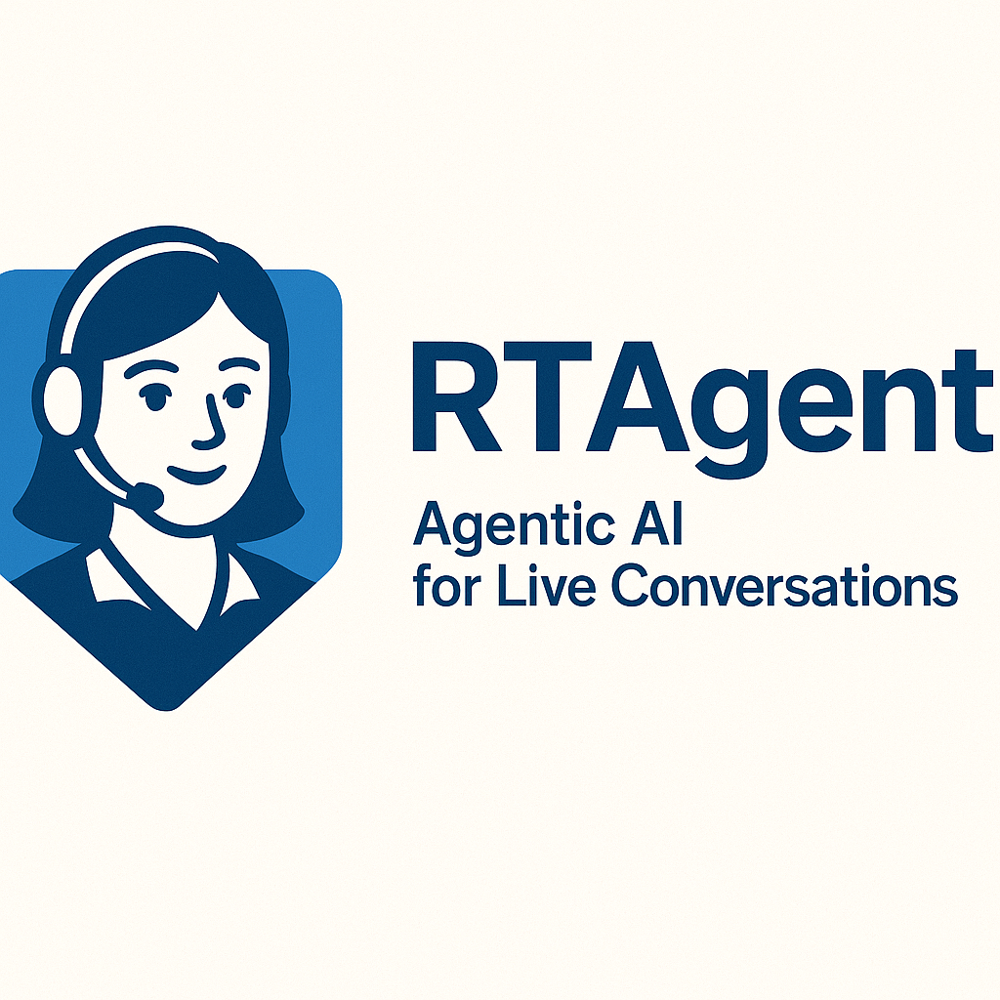

<!-- markdownlint-disable MD033 MD041 -->

# 🎙️ **RTVoice Accelerator**  
*Omni-channel, real-time voice-intelligence accelerator framework on Azure*

**RTAgent** is an accelerator that delivers a friction-free, AI-driven voice experience—whether callers dial a phone number, speak to an IVR, or click “Call Me” in a web app. Built entirely on generally available Azure services—Azure Communication Services, Azure AI, and Azure App Service—it provides a low-latency stack that scales on demand while keeping the AI layer fully under your control.

Design a single agent or orchestrate multiple specialist agents (claims intake, authorization triage, appointment scheduling—anything). The framework allows you to build your voice agent from scratch, incorporate long- and short-term memory, configure actions, and fine-tune your TTS and STT layers to give any workflow an intelligent voice.

## **Overview** 



> **88 %** of customers still make a **phone call** when they need real support  
> — yet most IVRs feel like 1999. **RTAgent** fixes that.

**RTAgent in a nutshell**

RT Agent is a plug-and-play accelerator, voice-to-voice AI pipeline that slots into any phone line, web client, or CCaaS flow. Caller audio arrives through Azure Communication Services (ACS), is transcribed by a dedicated STT component, routed through your agent chain of LLMs, tool calls, and business logic, then re-synthesised by a TTS component—all in a sub-second round-trip. Because each stage runs as an independent microservice, you can swap models, fine-tune latency budgets, or inject custom logic without touching the rest of the stack. The result is natural, real-time conversation with precision control over every hop of the call.


<br>

| What you get | How it helps |
|--------------|--------------|
| **Sub-second loop** (STT → LLM/Tools → TTS) | Conversations feel human, not robotic latency-ridden dialogs. |
| **100 % GA Azure stack** | No private previews, no hidden SKUs—easy procurement & support. |
| **Drop-in YAML agents** | Spin up FNOL claims bots, triage nurses, or legal intake in minutes. |
| **Micro-service architecture** | Swap models, tune latency, or add new business logic without redeploying the whole stack. |

## Deploy and Customize the Demo App Using the RTAgent Framework

### **🚀 One-Command Azure Deployment**

Provision the full solution—including App Gateway, Container Apps, Cosmos DB, Redis, OpenAI, and Key Vault—with a single command:

```bash
azd auth login
azd up   # ~15 min for complete infra and code deployment
```

**Key Features:**
- TLS managed by Key Vault and App Gateway
- KEDA auto-scales RT Agent workers
- All outbound calls remain within a private VNet

For a detailed deployment walkthrough, see [`docs/DeploymentGuide.md`](docs/DeploymentGuide.md).

**Project Structure Highlights:**

| Path                | Description                                 |
|---------------------|---------------------------------------------|
| apps/rtagent/backend| FastAPI + WebSocket voice pipeline          |
| apps/rtagent/frontend| Vite + React demo client                   |
| apps/rtagent/scripts| Helper launchers (backend, frontend, tunnel)|
| infra/              | Bicep/Terraform IaC                        |
| docs/               | Architecture, agents, tuning guides         |
| tests/              | Pytest suite                               |
| Makefile            | One-line dev commands                       |
| environment.yaml    | Conda environment spec (name: audioagent)   |

### *⚡ Run the app Local*

**Prerequisites:** Infra deployed (above), Conda, Node.js ≥ 18, Azure CLI with `dev-tunnel` extension.

**Backend (FastAPI + Uvicorn):**
```bash
git clone https://github.com/your-org/gbb-ai-audio-agent.git
cd gbb-ai-audio-agent/rtagents/RTAgent/backend
python -m venv .venv && source .venv/bin/activate
pip install -r requirements.txt
cp .env.sample .env   # Configure ACS, Speech, and OpenAI keys
python server.py      # Starts backend at ws://localhost:8010/realtime
```

**Frontend (Vite + React):**
```bash
cd ../../frontend
npm install
npm run dev           # Starts frontend at http://localhost:5173
```

> Need more help?
> Refer to [`apps/README.md`](apps/README.md) for a step-by-step walkthrough of the demo app built with the RTAgent framework, along with guidance on how to customize it for your specific use case.

## **Load and Chaos Testing**

Worried about the solution’s ability to scale under your application’s load? Here’s a guide to help you with horizontal scaling tests...
## **Deployment on Azure**

### Standard Deployment (Recommended)

```bash
azd auth login
azd up         # full infra + code (~15 min)
```

### Alternative Deployment (Without azd)

For environments where Azure Developer CLI cannot be used, we provide make targets that emulate azd functionality:

```bash
# Set required environment variables
export AZURE_SUBSCRIPTION_ID="<your-subscription-id>"
export AZURE_ENV_NAME="dev"
export AZURE_LOCATION="eastus2"

# Full deployment
make azure_up
```

**Alternative methods:**

1. **Using the azd emulator script:**
   ```bash
   # Unix/Linux/macOS
   ./devops/scripts/azd-emulator.sh up
   
   # Windows PowerShell
   .\devops\scripts\azd-emulator.ps1 up
   ```

2. **Step-by-step deployment:**
   ```bash
   make azure_init        # Initialize environment
   make azure_plan        # Review infrastructure plan
   make azure_provision   # Deploy infrastructure
   make azure_deploy      # Deploy applications
   ```

For detailed instructions, see: [`docs/AzdEmulation.md`](docs/AzdEmulation.md)

### Deployment Features

• SSL via Key Vault ‑> App Gateway  
• Container Apps auto-scale (KEDA)  
• Private Redis, Cosmos DB, OpenAI endpoints  

Step-by-step guide: `docs/DeploymentGuide.md`.

## **Load & Chaos Testing**

Targets: **<500 ms STT→TTS • 1k+ concurrent calls • >99.5 % success** (WIP)

```bash
az load test run --test-plan tests/load/azure-load-test.yaml
```

Additional load test scripts (Locust, Artillery) are available in [`docs/LoadTesting.md`](docs/LoadTesting.md).

## **Roadmap**
- Live Agent API integration
- Multi-modal agents (documents, images)

## **Contributing**
PRs & issues welcome—see `CONTRIBUTING.md` and run `make pre-commit` before pushing.

## **License & Disclaimer**
Released under MIT. This sample is **not** an official Microsoft product—validate compliance (HIPAA, PCI, GDPR, etc.) before production use.

<br>

> [!IMPORTANT]  
> This software is provided for demonstration purposes only. It is not intended to be relied upon for any production workload. The creators of this software make no representations or warranties of any kind, express or implied, about the completeness, accuracy, reliability, suitability, or availability of the software or related content. Any reliance placed on such information is strictly at your own risk.