<!-- markdownlint-disable MD033 MD041 -->

# 🎙️ **RTAgent**  
*Real-Time Voice Intelligence Framework on Azure*

> **RTAgent** fuses **Azure Communication Services (ACS)**, **Azure Speech**, **Azure OpenAI**, and first-class observability into a single low-latency voice stack. Plug in any YAML-defined agent—insurance FNOL, healthcare triage, legal intake—and go live **using only GA Azure services**.

## 📑 Table of Contents
1. [Overview](#overview)
2. [Key Features](#key-features)
3. [Solution Architecture](#solution-architecture)
4. [Latency & Barge-In Budget](#latency--barge-in-budget)
5. [Extensibility](#extensibility)
6. [Getting Started](#getting-started)
    1. [Local Quick-Start](#local-quick-start)
7. [Deployment on Azure](#deployment-on-azure)
8. [Load & Chaos Testing](#load--chaos-testing)
9. [Repository Layout](#repository-layout)
10. [Roadmap](#roadmap)
11. [Contributing](#contributing)
12. [License & Disclaimer](#license--disclaimer)

## **Overview** 


> **88 %** of customers still make a **phone call** when they need real support  
> — yet most IVRs feel like 1999. **RTAgent** fixes that.

**RTAgent in a nutshell**

RTAgent is a voice-to-voice AI pipeline that you can splice into any phone line, web client, or CCaaS flow. Audio enters through ACS, is transcribed on the fly, routed through your own modular agent chain, and then streamed back as TTS— all in a single sub-second loop. Every step is exposed as a micro-module so you can fine-tune latency, swap models, or inject custom business logic without touching the rest of the stack. The result: natural conversation and granular control over each hop of the call.

### **✨ Key Capabilities**

- **Omni-channel** — same agent for PSTN, Teams, or web chat (see diagram below).  
- **YAML-defined agents** — hot-swap FNOL, triage, billing, or any custom intent with **low code**.  
- **Robust barge-in** — partial STT cancels TTS instantly; no “talk-over” frustration.  
- **Structured output** — native JSON / function calling ready for CRM, EMR, or claims systems.  
- **Enterprise WebSocket middleware** — unifies voice-to-voice streams, elastically multiplexes thousands of concurrent sessions, and slots cleanly into existing CX stacks for at-scale conversational routing.  


*(Left: callers on web & phone → RTAgent; right: seamless CCaaS escalation when a human is truly needed)*

## **Key Features**

| Category | Highlights |
|----------|------------|
| 🔄 Streaming | Bidirectional (PSTN ↔ WebSocket ↔ LLM) with < 500 ms RTT |
| 🧠 Agents | Drop-in FNOL, Healthcare, Legal, or custom YAML agents |
| 📊 Model Router | GPT-4o, GPT-4o-mini, phi per turn (cost/speed/quality aware) |
| 🧰 Tools | Function-calling tool store; call external APIs in-flight |
| 📈 Scale | Queue-backed session manager across Container Apps replicas |
| 🛡️ Enterprise | App Gateway + WAF, private endpoints, managed identity |
| 🧪 Testing | Azure Load Testing, Locust, Artillery scripts included |
| 📞 CCaaS Bridge | Seamless SIP hand-off between ACS and any CCaaS (Amazon Connect, Genesys, Five9) |

## **Solution Architecture**

```mermaid
flowchart LR
  %% ─────────────── 1 · Users ─────────────────────
  subgraph "Users"
    PSTN["📞 PSTN / Teams"]
    WEB["🌐 Web / Mobile"]
  end

  %% ─────────────── 2 · Telco Bridge ──────────────
  subgraph "Telco Bridge (PSTN only)"
    CCaaS["🏢 CCaaS / Telco"]
    ACS["🔗 Azure Comm Svc"]
  end

  %% ─────────────── 3 · Real-Time Engine ──────────
  subgraph "🎙️ Real-Time Engine"
    Planner["🧭 Planner / Orchestrator"]
    Tools["🔧 Tool Store"]
    Memory["🗃️ Memory Store"]

    %% ---- RTAgent with internal pipeline
    subgraph RTAgent
      STT["STT"] --> LLM["LLM"] --> TTS["TTS"]
    end

    %% LLM reaches out to stores (dashed = data look-ups)
    LLM -.-> Tools
    LLM -.-> Memory
  end

  %% === Inbound voice =========================================================
  PSTN --> CCaaS -->|SIP / RTP| ACS -->|WebSocket audio| Planner
  WEB  -->|WebSocket audio| Planner

  %% === Planner → Agent =======================================================
  Planner --> RTAgent
  RTAgent --> Planner

  %% === Outbound voice (same path back) =======================================
  Planner -->|WebSocket audio| ACS --> CCaaS --> PSTN
  Planner -->|WebSocket audio| WEB

  %% Styling
  classDef bridge fill:#0078D4,color:#fff,stroke-width:2px
  classDef store  fill:#FFE082,color:#000,stroke-width:1px,stroke:#F57F17,stroke-dasharray: 5
  class CCaaS,ACS bridge
  class Tools,Memory store
```



Detailed flow, infra, and state diagrams live in `docs/Architecture.md`.

## **Latency & Barge-In Budget**

| Hop | Target | Key Tuning |
|-----|--------|------------|
| STT first-byte | 40–60 ms | WebSocket streaming models |
| LLM token | 15–40 ms | GPT-4o / cost-tier routing |
| TTS first-byte | 45–70 ms | 24 kHz output, low-latency mode |
| Network | ~20 ms | Same-region services |

**Barge-In Flow**

1. Partial STT from ACS (<10 ms) triggers `on_partial`.  
2. Current TTS stream cancelled; `StopAudio` sent to ACS.  
3. New speech queued; playback starts immediately—no audible clip.  

Full code walk-through: `docs/ACSBargeInFlow.md`.

## **Extensibility**

| Extension Point | How-To |
|-----------------|--------|
| 🧩 New Agent | Implement new agents in `rtagents/agents/` |
| 🔧 Tool | Add a function in `tools/`, reference in YAML |
| 🧠 Memory | Swap Redis for Cosmos DB / Vector DB |
| 🎯 Router | Edit `router.yaml` to balance cost vs. speed |

Cross-cloud and CCaaS integrations are documented in `docs/IntegrationPoints.md`.

## **Getting Started**

### Local Quick-Start

```bash
# 1️⃣ Backend (FastAPI + Uvicorn)
git clone https://github.com/your-org/gbb-ai-audio-agent.git
cd gbb-ai-audio-agent/rtagents/RTAgent/backend
python -m venv .venv && source .venv/bin/activate
pip install -r requirements.txt
cp .env.sample .env   # add ACS, Speech, OpenAI keys
python server.py      # ws://localhost:8010/realtime
```

```bash
# 2️⃣ Frontend (Vite + React)
cd ../../frontend
npm install
npm run dev           # http://localhost:5173
```

Dial-in from a real phone? Expose your backend with **Azure Dev Tunnels**, update `BASE_URL` in both `.env` files, and mirror the URL in the ACS event subscription.

## **Deployment on Azure**

```bash
azd auth login
azd up         # full infra + code (~15 min)
```

• SSL via Key Vault ‑> App Gateway  
• Container Apps auto-scale (KEDA)  
• Private Redis, Cosmos DB, OpenAI endpoints  

Step-by-step guide: `docs/DeploymentGuide.md`.

## **Load & Chaos Testing**

Targets: **<500 ms STT→TTS • 1k+ concurrent calls • >99.5 % success** (WIP)

```bash
az load test run --test-plan tests/load/azure-load-test.yaml
```

Locust & Artillery scripts: `docs/LoadTesting.md`.


## **Repository Layout**
```text
gbb-ai-audio-agent/
├── .github/          # CI / CD
├── docs/             # Architecture, Deployment, Integration
├── infra/            # Bicep modules & azd templates
├── rtagents/         # Core Python package (agents, tools, router) [backend + Frontend (React + Vite frontend)]
├── labs/             # Jupyter notebooks & PoCs
├── src/              # source code libraries
├── tests/            # pytest + load tests
├── utils/            # diagrams & helper scripts
└── Makefile, docker-compose.yml, CHANGELOG.md …
```

## **Roadmap**
- Live Agent API integration
- Multi-modal agents (docs + images)  

## **Contributing**
PRs & issues welcome—see `CONTRIBUTING.md` and run `make pre-commit` before pushing.

## **License & Disclaimer**
Released under MIT. This sample is **not** an official Microsoft product—validate compliance (HIPAA, PCI, GDPR, etc.) before production use.

<br>

> [!IMPORTANT]  
> This software is provided for demonstration purposes only. It is not intended to be relied upon for any production workload. The creators of this software make no representations or warranties of any kind, express or implied, about the completeness, accuracy, reliability, suitability, or availability of the software or related content. Any reliance placed on such information is strictly at your own risk.