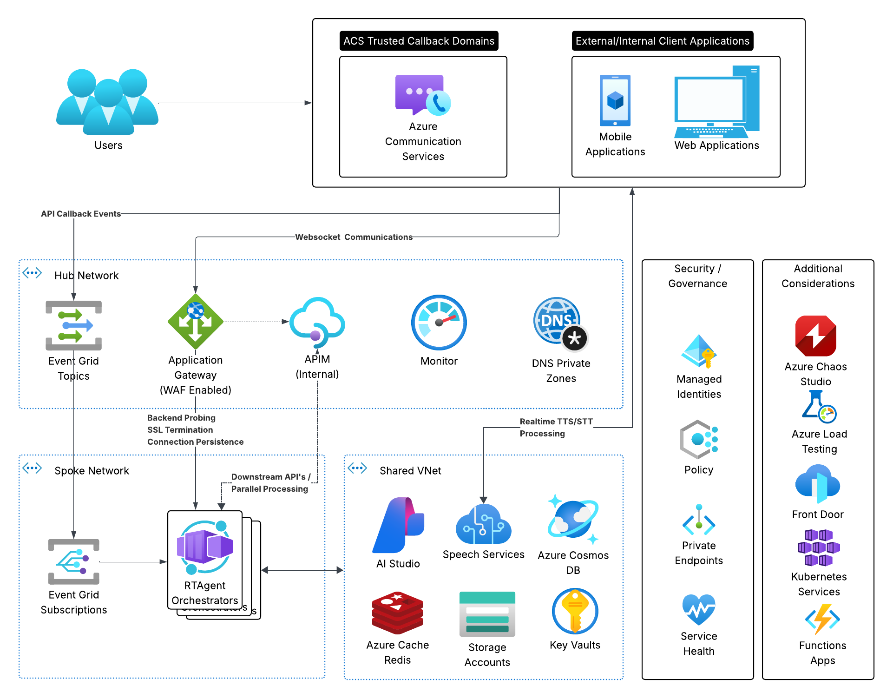
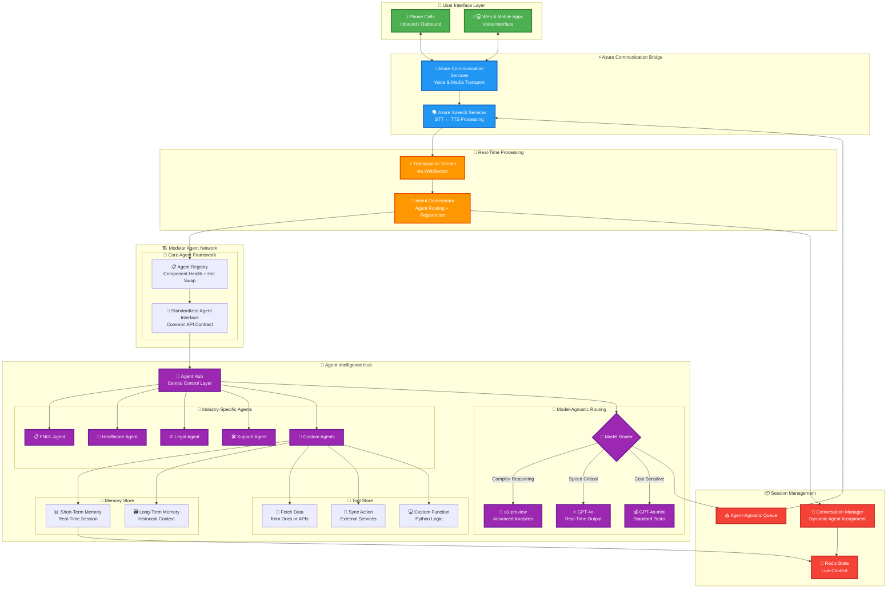
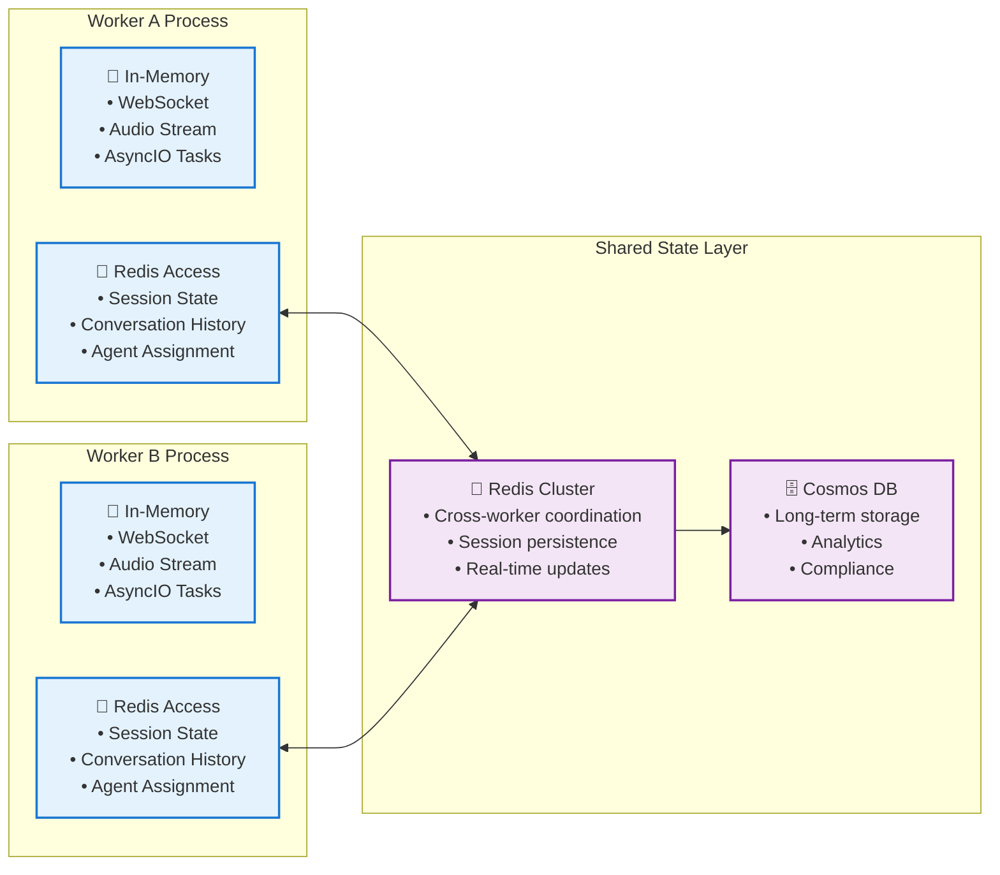

# Azure Communication Services (ACS) Real-Time Audio Agent Architecture

## Table of Contents
1. [Overview](#overview)
2. [Production Deployment Architecture](#production-deployment-architecture)
3. [Logical Architecture Overview](#logical-architecture-overview)
4. [Component Mapping & Integration](#component-mapping--integration)
5. [Event-Driven Architecture & Data Flow](#event-driven-architecture--data-flow)
6. [State Management & Data Persistence](#state-management--data-persistence)
7. [Key Architectural Advantages](#key-architectural-advantages)

## Overview

This document provides a comprehensive architectural overview of the Azure Communication Services (ACS) Real-Time Audio Agent system, designed for enterprise-scale voice AI applications. The architecture supports modular, industry-specific AI agents with real-time voice processing capabilities.

**Architecture Perspectives:**
- **Production Deployment**: Enterprise Azure infrastructure with scalability, security, and reliability
- **Logical Components**: Application-layer architecture focusing on modular agent design
- **Event-Driven Flow**: Real-time data processing and state management patterns
- **Integration Patterns**: How production infrastructure maps to logical components

The system enables plug-and-play AI agents for various industries (insurance, healthcare, legal, support) while maintaining a unified communication interface through Azure Communication Services.

## Production Deployment Architecture



The production deployment architecture illustrates the enterprise-ready Azure infrastructure hosting our real-time audio agent system. This deployment emphasizes **scalability**, **reliability**, and **security** across multiple Azure services.

### Key Infrastructure Components

#### 🔀 **Flexible Ingress Layer**
- **App Gateway (WAF)**: SSL termination, backend health probing, and Web Application Firewall protection
- **Azure Front Door**: Optional global entry point for geo-failover and CDN capabilities
- **Load Balancing**: Intelligent traffic distribution across healthy backend instances

#### 🔐 **Secured API Exposure**
- **Azure API Management (Internal)**: Centralized API gateway behind App Gateway
- **WAF Protection**: Advanced threat protection and traffic filtering
- **Private VNet Integration**: Secured internal network connectivity

#### 🧠 **Modular Agent Platform**
- **RTAgent Orchestrator**: Supports multiple IVR engines and swappable LLM chains
- **Dynamic Routing**: Redis-based session metadata for intelligent agent selection
- **Multi-Agent Framework**: Industry-specific agents with standardized interfaces

#### ⚙️ **Flexible Compute Options**
- **Primary**: Azure Container Apps with auto-scaling capabilities
- **Alternative**: Azure Functions, AKS, or VMs for specific SLA requirements
- **Microservices**: Each agent runs as an independent, scalable service

#### 🧭 **Private Connectivity**
- **Private Endpoints**: All Azure services (Redis, Cosmos DB, OpenAI) use private networking
- **Private DNS Zones**: Linked across hub/spoke VNet topology
- **Network Security**: End-to-end private connectivity with no public internet exposure

#### 🛡️ **Security & Compliance**
- **Security Layers**: Prompt shields, LLM safety checks, and API firewalls
- **Monitoring**: Microsoft Defender, Azure Sentinel for threat detection
- **Message Sanitization**: Input validation and content filtering

#### 🧬 **Reliability & Health Monitoring**
- **Azure Service Health**: Multi-region availability monitoring
- **Health Probes**: Application Gateway backend health checks
- **Failover Support**: Active/passive fallback for RTAgents and Speech services

---

## Logical Architecture Overview

The logical architecture abstracts the underlying Azure infrastructure to focus on application components, data flow, and business logic. This view emphasizes the **modular agent design** and **real-time processing capabilities**.

### Core Architecture Diagram



---

## Component Mapping & Integration

This section maps the production Azure infrastructure to the logical application components, showing how the enterprise deployment supports the modular agent architecture.

### Infrastructure-to-Logic Mapping

| **Production Component** | **Logical Component** | **Integration Pattern** | **Scalability Model** |
|-------------------------|----------------------|------------------------|----------------------|
| **Azure App Gateway + WAF** | User Interface Layer | HTTP/HTTPS ingress, SSL termination | Horizontal scaling with health probes |
| **Azure Communication Services** | Communication Bridge | WebRTC, PSTN integration | Auto-scaling based on concurrent calls |
| **Container Apps (RTAgent)** | Agent Network | Microservices with REST APIs | KEDA-based auto-scaling |
| **Azure OpenAI Service** | AI Model Hub | HTTP API with managed identity | Request-based throttling and quotas |
| **Azure Redis Cache** | Session Management | In-memory state with TTL | Cluster mode with read replicas |
| **Azure Cosmos DB** | Persistent Storage | NoSQL with global distribution | Provisioned or serverless throughput |
| **Azure Speech Services** | STT/TTS Processing | REST API with streaming | Concurrent request scaling |
| **Event Grid** | Event Processing | Pub/sub with guaranteed delivery | Topic-based fan-out scaling |

### Integration Patterns

#### **🔄 State Synchronization**
- **Redis**: Real-time session state shared across all agent instances
- **Cosmos DB**: Persistent conversation history and user profiles
- **Event Grid**: Asynchronous state change notifications

#### **🎯 Dynamic Agent Routing**
- **Agent Registry**: Container Apps self-register with health endpoints
- **Load Balancer**: App Gateway routes based on agent availability
- **Session Affinity**: Redis maintains agent-to-session mapping

#### **🔐 Security Integration**
- **Managed Identity**: All Azure services use credential-less authentication
- **Private Endpoints**: No public internet exposure for backend services
- **API Management**: Centralized authentication and rate limiting

---

## Event-Driven Architecture & Data Flow

The system operates on an event-driven architecture that enables real-time processing and seamless integration with external systems.

### Real-Time Event Processing Flow

```mermaid
flowchart TD

%% ────────────────────────────────  User Interface  ───────────────────────────
subgraph "👥 User Interface Layer"
    Phone["📞 Phone Calls<br/>Inbound/Outbound"]
    WebMobile["📱💻 Web & Mobile Apps<br/>Real-time Voice Interface"]
end

%% ─────────────────────────── Azure Communication Bridge ──────────────────────
subgraph "⚡ Azure Communication Bridge"
    ACS["🔗 Azure Communication Services<br/>Voice & Media Management"]
    Speech["🗣️ Azure Speech Services<br/>STT ↔ TTS Processing"]
end

%% ──────────────────────────────  AI Processing  ──────────────────────────────
subgraph "🧠 AI Processing Engine"
    WebSocket["⚡ Real-time WebSocket<br/>Transcription Stream"]
    Orchestrator["🎯 Intent Orchestrator<br/>Smart Agent Routing<br/>🔌 Dynamic Agent Registration"]
end

%% ───────────────────────────  Modular Agent Network  ─────────────────────────
subgraph "🤖 Modular Agent Network"

    %% ── Core Agent Framework
    subgraph "🔌 Core Agent Framework"
        AgentRegistry["📋 Agent Registry<br/>🔄 Hot-Swappable Components<br/>📊 Health Monitoring"]
        AgentInterface["🔗 Standardized Agent Interface<br/>🏗️ Common API Contract<br/>⚙️ Plugin Architecture"]
        AgentInterface --> AgentRegistry
    end

    %% ── AI Model Hub (parent container for the two branches)
    subgraph "🧠 AI Model Hub"
        direction TB

        %% ── Branch 1: Industry-Specific Agents
        subgraph "🏢 Industry-Specific Agents"
            Auth["🔐 Auth Agent<br/>🔌 Pluggable"]
            FNOL["📋 FNOL Agent<br/>🔌 Pluggable"]
            Healthcare["🏥 Healthcare Agent<br/>🔌 Pluggable"]
            Legal["⚖️ Legal Agent<br/>🔌 Pluggable"]
            Support["🛠️ Support Agent<br/>🔌 Pluggable"]
            NAgents["💬 Custom Agents<br/>🔌 Unlimited Extensibility"]
        end

        %% ── Branch 2: Model-Specific Execution
        subgraph "🧬 Model-Specific Execution"
            TaskRouter{🎯 Model Router}
            TaskRouter -->|Complex Reasoning| O1["🔬 o1-preview<br/>Advanced Analytics"]
            TaskRouter -->|Speed Critical| GPT4o["⚡ GPT-4o<br/>Real-time Response"]
            TaskRouter -->|Cost Efficient| GPT4oMini["💰 GPT-4o-mini<br/>Standard Queries"]
        end
    end
end

%% ───────────────────────────── Session Management ────────────────────────────
subgraph "🏗️ Session Management"
    Queue["📥 Message Queue<br/>🔌 Agent-Agnostic Routing"]
    Redis["💾 Redis State<br/>📊 Real-time Session Data"]
    Manager["🔄 Conversation Manager<br/>🎯 Dynamic Agent Assignment"]
end

%% ────────────────────────────  Flow Connections  ─────────────────────────────
Phone      <--> ACS
WebMobile  <--> ACS
ACS        <--> Speech
Speech     <--> WebSocket
WebSocket  <--> Orchestrator

Orchestrator <--> AgentRegistry  %% Orchestrator sees live registry status

%% Industry agents to router
Auth       --> TaskRouter
FNOL       --> TaskRouter
Healthcare --> TaskRouter
Legal      --> TaskRouter
Support    --> TaskRouter
NAgents    --> TaskRouter

%% Router to queue → TTS chain
TaskRouter --> Queue
Queue      --> Speech

%% State management links
Orchestrator <--> Manager
Manager      <--> Redis

%% ──────────────────────────────  Styling  ────────────────────────────────────
classDef user   fill:#4CAF50,stroke:#2E7D32,stroke-width:3px,color:#FFFFFF
classDef bridge fill:#2196F3,stroke:#1565C0,stroke-width:3px,color:#FFFFFF
classDef proc   fill:#FF9800,stroke:#E65100,stroke-width:3px,color:#FFFFFF
classDef agent  fill:#9C27B0,stroke:#6A1B9A,stroke-width:3px,color:#FFFFFF
classDef infra  fill:#F44336,stroke:#C62828,stroke-width:3px,color:#FFFFFF

class Phone,WebMobile user
class ACS,Speech bridge
class WebSocket,Orchestrator proc
class Auth,FNOL,Healthcare,Legal,Support,NAgents,O1,GPT4o,GPT4oMini,TaskRouter agent
class Queue,Redis,Manager infra
```

### Key Event Types

| **Event Type** | **Trigger** | **Payload** | **Subscribers** |
|---------------|-------------|-------------|-----------------|
| `CALL_STARTED` | ACS call connection | Session ID, caller info | Analytics, logging, resource allocation |
| `PARTICIPANT_JOINED` | New participant | Participant details | Authentication, notifications |
| `TRANSCRIPTION_RECEIVED` | STT completion | Text, confidence, timestamp | AI processing, storage |
| `AGENT_RESPONSE_GENERATED` | AI completion | Response text, agent type | TTS, analytics |
| `RECORDING_STARTED` | Call recording begins | Recording ID, metadata | Compliance, storage |
| `ERROR_OCCURRED` | System errors | Error details, context | Alerting, diagnostics |
| `CALL_ENDED` | Call termination | Duration, outcome | Billing, analytics, cleanup |

---

## State Management & Data Persistence

The architecture implements a multi-tiered data strategy optimized for real-time performance and long-term persistence.

### Data Storage Strategy

| **Data Type** | **Storage** | **Shared** | **Persistence** | **Use Case** | **TTL/Retention** |
|---------------|:-----------:|:----------:|:---------------:|--------------|:------------------:|
| **Session Metadata** | 🗄️ Cosmos DB | ✅ Yes | 📅 Long-term | Call history, compliance | 7 years |
| **Active Session State** | 🔄 Redis | ✅ Yes | ⏱️ Short-term | Real-time conversation | 24 hours |
| **Transcription History** | 🗄️ Cosmos DB | ✅ Yes | 📅 Long-term | Audit, training data | 7 years |
| **Live Transcription** | 🔄 Redis | ✅ Yes | ⏱️ Real-time | Active conversation | 1 hour |
| **Agent Performance** | 🗄️ Cosmos DB | ✅ Yes | 📅 Long-term | Analytics, optimization | 2 years |
| **User Profiles** | 🗄️ Cosmos DB | ✅ Yes | 📅 Long-term | Personalization | Indefinite |
| **WebSocket Connections** | 💾 In-Memory | ❌ No | ⚡ Process-bound | Real-time communication | Process lifetime |
| **Audio Streams** | 💾 In-Memory | ❌ No | ⚡ Process-bound | STT processing | Stream duration |
| **Conversation Context** | 🔄 Redis | ✅ Yes | ⏱️ Short-term | AI grounding | Session + 1 hour |

### Cross-Worker State Management



### Key Design Principles

#### **🔄 Eventual Consistency**
- Redis provides immediate consistency for active sessions
- Cosmos DB ensures eventual consistency for historical data
- Event Grid guarantees at-least-once delivery for state changes

#### **⚡ Performance Optimization**
- Hot data (active sessions) stored in Redis for sub-millisecond access
- Cold data (historical records) stored in Cosmos DB with query optimization
- In-memory objects for process-bound, real-time operations

#### **🛡️ Fault Tolerance**
- Redis cluster with read replicas for high availability
- Cosmos DB multi-region distribution with automatic failover
- Graceful degradation when shared state is temporarily unavailable

---

## Key Architectural Advantages

### 🔌 **Enterprise-Grade Modularity**

#### **Plug-and-Play Agent Ecosystem**
- **🏗️ Standardized Interface**: Common API contract ensures seamless agent integration
- **📋 Dynamic Discovery**: Agents self-register with capability metadata for automatic routing
- **🔄 Hot-Swapping**: Deploy new agents without system downtime or session interruption
- **⚙️ Configuration-Driven**: Add industry-specific agents through YAML configuration changes

#### **Channel-Agnostic Communication**
- **🔌 Unified Hub**: ACS abstracts communication protocols (voice, SMS, Teams, WhatsApp)
- **📡 Event-Driven**: New channels integrate through existing event processing pipeline
- **🌐 Protocol Independence**: Voice, text, and video flow through standardized interfaces

### ⚡ **Zero-Friction Scalability**

#### **Azure-Native Auto-Scaling**
- **🏗️ Container Apps**: Built-in KEDA scaling based on HTTP requests and queue depth
- **⚖️ Intelligent Load Balancing**: Application Gateway with health probes and session affinity
- **📈 Predictive Scaling**: Azure Monitor integration for pattern-based resource allocation

#### **Microservices Excellence**
- **🔄 Service Mesh Ready**: Istio support for advanced traffic management and observability
- **🚀 Zero-Downtime Deployments**: Blue-green deployments with Container Apps revisions
- **🔐 Workload Identity**: Managed identities for credential-less Azure service access
- **📊 Distributed Telemetry**: End-to-end tracing with Application Insights

### 🚀 **Future-Proof Design**

#### **Technology-Agnostic Foundation**
- **🧠 Model Router**: Intelligent routing across GPT, Claude, Gemini based on performance and cost
- **🔌 Cloud-Agnostic**: Vendor-neutral design supporting hybrid and multi-cloud deployments
- **📈 Unlimited Extensibility**: Support for unlimited agent types with specialized knowledge domains

> **Note**: Model routing capability uses simple YAML configurations mapping agents/tasks to specific models. Advanced routing features are planned for future implementation.

#### **Adaptive Intelligence**
- **🎯 Context-Aware Routing**: Automatic agent selection based on detected intent and user context
- **📊 Performance Optimization**: Continuous optimization based on success rates and satisfaction metrics
- **🔄 Machine Learning Integration**: Agent performance data feeds back into routing algorithms

---

This architecture documentation provides a comprehensive view from enterprise deployment to detailed implementation, enabling both infrastructure teams and developers to understand how the production Azure environment supports the modular, real-time AI agent system.
