# Healthcare Voice Agent Use Cases

## Voice Agent Platform for Healthcare

```mermaid
flowchart TD
    %% Business Drivers
    subgraph Business ["🎯 Healthcare Business Drivers"]
        A["💰 Cost Pressures"]
        B["📋 Documentation Burden"]
        C["🏥 Care Complexity"]
    end

    %% Healthcare Solutions
    subgraph Solutions ["🏥 Voice Agent Solutions"]
        D["🎭 Virtual Care"]
        E["📝 Real-time Docs"]
        F["⚕️ Patient Monitoring"]
        G["🔐 Prior Auth"]
        H["🔬 Trial Screening"]
        I["🧭 Health Navigation"]
        M["🗣️ EMR Voice Interface"]
    end

    %% Technical Platform
    subgraph Platform ["⚡ Voice Agent Platform"]
        
        %% Voice Layer
        J["🎙️ Voice Processing<br/>ACS | Speech | OpenAI"]
        
        %% Agent Layer
        K["🤖 AI Agents<br/>🩺 Medical | 🛡️ Insurance | 🎯 Routing"]
        
        %% Integration Layer
        L["🔌 Integrations<br/>🏥 Clinical | 💰 Payer | 💾 Data | 📋 EMR"]
    end

    %% Connections
    Business --> Solutions
    Solutions --> J
    J --> K
    K --> L

    %% Styling
    classDef business fill:#3498db,stroke:#2c3e50,stroke-width:2px,color:#ffffff
    classDef solution fill:#2ecc71,stroke:#27ae60,stroke-width:2px,color:#ffffff
    classDef tech fill:#e67e22,stroke:#d35400,stroke-width:2px,color:#ffffff

    class A,B,C business
    class D,E,F,G,H,I,M solution
    class J,K,L tech
```

## 🏥 Healthcare Voice Agent Use Cases

*Powered by Azure Communication Services & AI*

### 🩺 **Clinical Care & Patient Services**
| 🎯 | **Use Case** | **👥 Who Benefits** | **⚡ How ACS Powers It** | **📈 Business Impact** |
|:---:|-------------|-------------------|----------------------|---------------------|
| **1** | **🥠Nurse Triage Hotline** | Patients seeking symptom guidance | **🔄** PSTN → Call Automation routes to AI triage **🎙️** Real-time speech → symptom analysis **👥** Seamless handoff to on-call nurse via Teams | **30-50%** reduction in routine calls **⚡ Faster** patient care |
| **2** | **📅 Smart Appointment Scheduling** | Outpatient clinics & scheduling teams | **🤖** 24/7 bot handles inbound calls/texts **🔌** FHIR integration for real-time slot availability **📲** Automated SMS/email confirmations | **10-15%** reduction in no-shows **🕒 24/7** self-service availability |
| **5** | **🠠Post-Discharge Follow-Up** | Care management & readmission teams | **⚡** Event Grid triggers after EHR discharge **📊** Automated vitals surveys via ACS calls **🚨** Alert escalation to nurses via Teams | **5-10%** readmission reduction **🔠Proactive** care monitoring |
| **6** | **🧠 Crisis Mental Health Line** | Behavioral health services | **🌙** 24/7 hotline with sentiment analysis **👨‍⚕️** Auto-conference licensed counselors **🔴** High-risk phrase detection & escalation | **⚡ Faster** crisis intervention **☎️ 988 compliance** ready |

---

### 💊 **Pharmacy & Prior Authorization**

| 🎯 | **Use Case** | **👥 Who Benefits** | **⚡ How ACS Powers It** | **📈 Business Impact** |
|:---:|-------------|-------------------|----------------------|---------------------|
| **3** | **💊 Prescription Refill & Prior-Auth** | Pharmacies & PBM operations | **ğŸ“** IVR captures Rx numbers automatically **🧠** Azure Speech + LUIS for intent recognition **🎯** Smart escalation for complex cases | **⏱️ 40 seconds** average handle time reduction **🤖 Automated** routine requests |
| **9** | **💰 Insurance Verification & Appeals** | Revenue cycle operations | **🗣️** Self-service IVR with GPT explanations **ğŸ“** Auto-generated appeal letter drafts **🧭** Intelligent case routing | **💸 Faster** reimbursements **📉 Reduced** manual processing |

---

### 🌐 **Specialized Services**

| 🎯 | **Use Case** | **👥 Who Benefits** | **⚡ How ACS Powers It** | **📈 Business Impact** |
|:---:|-------------|-------------------|----------------------|---------------------|
| **4** | **🌠On-Demand Interpreters** | Emergency departments & inpatient units | **🗣️** Language detection via Speech services **ğŸ“** Three-way calls with remote interpreters **💬** Live captioning + real-time translation | **✅ Joint Commission** LEP compliance **🢠No onsite** interpreter staff needed |
| **7** | **📠Clinical Documentation Assistant** | Physicians & medical coders | **ğŸ¤** Real-time audio transcription **🤖** AI-generated SOAP notes + CPT/ICD codes **🔗** Direct EHR integration via HL7/FHIR | **â° 2-4 minutes** saved per encounter **🯠Higher** coding accuracy |
| **8** | **🥠Rural Tele-Consult Network** | Community hospitals & specialists | **🚨** Emergency-triggered specialist calls **💻** Teams integration with screen sharing **🖼ï¸** DICOM viewer support in same session | **⚡ Faster** critical decisions **💰 Lower** transfer costs |
| **10** | **🔬 Secure Research Study Hotline** | Clinical trial coordinators | **🔢** Unique numbers per study arm **🔐** Encrypted recordings in Key Vault **📊** Power BI dashboards for PIs | **🛡️ HIPAA-compliant** participant engagement **📋 Auditable** research processes |

---

### 🎯 **Platform Benefits Summary**

| **Operational Excellence** | **Clinical Impact** | **Financial Results** |
|:-------------------------:|:------------------:|:--------------------:|
| 🕒 **24/7 Availability** | ⚡ **Faster Care Delivery** | 💰 **Cost Reduction** |
| 🔄 **Automated Workflows** | 🎯 **Better Outcomes** | 📈 **Revenue Protection** |
| 🔐 **Enterprise Security** | 👥 **Improved Experience** | ⚖️ **Compliance Ready** |

---

> **Legend — Key ACS building blocks used**  
> *Call Automation*, *WebSocket media streaming*, *Teams interop*, *Azure Speech & OpenAI*, *Event Grid*, *Cosmos DB*, *API Management*, *App Gateway / WAF*.

### 🔧 **Core Azure Building Blocks**

| Component | Purpose |
|-----------|---------|
| **🔄 Call Automation** | Programmable voice workflows |
| **🌐 WebSocket Media Streaming** | Real-time audio processing |
| **👥 Teams Interop** | Seamless handoffs to live agents |
| **🗣️ Azure Speech & OpenAI** | STT/TTS and intelligent responses |
| **⚡ Event Grid** | Trigger-based automation |
| **🗄️ Cosmos DB** | Patient data and session state |
| **🔐 API Management** | Secure healthcare integrations |
| **🛡️ App Gateway / WAF** | Enterprise security and routing |

