# Integration Points: Adopting FastAPI Azure Voice Backend with AWS

> **Disclaimer:** The service mappings, API flows, and integration patterns in this document are based on current AWS and Azure documentation as of June 2025. Actual compatibility and performance characteristics may vary. These integrations should be validated in a proof-of-concept environment and reviewed against the latest provider documentation for updates or breaking changes.

## Table of Contents

1. [Overview](#overview)
2. [Integration Scenarios](#integration-scenarios)
    - [2.1 AWS Connect with Azure Voice Backend](#21-aws-connect-with-azure-voice-backend)
    - [2.2 AWS Connect to Azure Communication Services](#22-aws-connect-to-azure-communication-services)
    - [2.3 Cross-Cloud General Considerations](#23-cross-cloud-general-considerations)
3. [Service Mapping & Interchangeability](#service-mapping--interchangeability)
4. [LLM Integration Patterns](#llm-integration-patterns)
5. [Validation & Testing](#validation--testing)

---

## 1. Overview

This document outlines key integration points and scenarios for adopting the FastAPI-based Azure Voice Agent backend into existing AWS-based client environments, including AWS Connect and telephony backends.

---

## 2. Integration Scenarios

### 2.1 AWS Connect with Azure Voice Backend

**Scenario:** Enterprise uses AWS Connect for contact center telephony and wants to leverage Azure's real-time voice agent backend for advanced speech, transcription, or LLM-powered workflows.

**Integration Points:**

- **API Gateway:**
  - Expose FastAPI endpoints (e.g., `/api/call`, `/call/stream`) via public API Gateway (AWS API Gateway or Azure API Management)
  - Secure endpoints with OAuth2/JWT or AWS IAM roles
  
- **AWS Lambda / Step Functions:**
  - Use Lambda functions to invoke FastAPI endpoints for call events, transcription, or agent actions
  - Pass call metadata (session/correlation IDs) for traceability
  
- **WebSocket Streaming:**
  - AWS Connect streams audio to Lambda or Kinesis; adapt to forward PCM audio frames to FastAPI `/call/stream` WebSocket endpoint
  - Use AWS SDKs or custom connectors to bridge audio streams
  
- **State Management:**
  - Use Redis for ephemeral session state, accessible from both AWS and Azure (via VPC peering or managed Redis)
  
- **Event Handling:**
  - Integrate AWS EventBridge or SNS/SQS with FastAPI's event endpoints for cross-cloud event propagation

### 2.2 AWS Connect to Azure Communication Services

**Scenario:** AWS Connect is the entry point for inbound calls, but calls need to be routed to Azure Communication Services (ACS) for advanced processing or agent handoff.

#### 2.2.1 High-Level Support Matrix

| Capability | Supported? | Where It Runs | Notes |
|------------|-----------|---------------|-------|
| SIP trunk hand-off | **Yes** | AWS Connect → SBC → ACS | External Voice Transfer Connector (Connect) ⟷ Direct Routing (ACS) |
| Keep existing IVR | **Yes** | AWS Connect | Only the live agent leg is transferred to ACS |
| Dual call recording | **Yes** | Both | Correlate Connect ContactId ↔ ACS serverCallId |
| WebSocket media stream | **Yes (ACS)** | ACS | Bidirectional PCM frames for ASR/TTS/Bot |
| Live media from Connect | **Yes (Kinesis)** | Amazon Connect | Use Live Media Streaming block → Kinesis |
| Chat / messaging federation | **No** | — | Separate SDKs, build your own bridge |
| Unified agent desktop | **Not OOTB** | — | Build/buy custom desktop for CCP + ACS |
| Cross-platform metrics | **Custom** | — | Pipe EventBridge + Azure Monitor → BI |

#### 2.2.2 Reference Architecture

```mermaid
flowchart TB
     %% Define styles
     classDef awsStyle fill:#FF9900,stroke:#232F3E,stroke-width:2px,color:#fff
     classDef azureStyle fill:#0078D4,stroke:#0053A0,stroke-width:2px,color:#fff
     classDef sbcStyle fill:#9C27B0,stroke:#4A148C,stroke-width:2px,color:#fff
     classDef dataStyle fill:#4CAF50,stroke:#2E7D32,stroke-width:2px,color:#fff
     classDef eventStyle fill:#FF5722,stroke:#BF360C,stroke-width:2px,color:#fff

     %% Caller
     Caller["👤 Caller"]

     %% AWS Services
     subgraph AWS ["🔶 Amazon Web Services"]
          direction TB
          Connect["📞 AWS Connect<br/><small>Contact Center & IVR</small>"]
          EVTC["🔄 External Voice Transfer<br/><small>Connector</small>"]
          EventBridge["📊 EventBridge<br/><small>Event Routing</small>"]
          S3["🗄️ S3<br/><small>Call Recording</small>"]
          
          Connect --> EVTC
          Connect --> EventBridge
          Connect -.->|"Recording"| S3
     end

     %% Session Border Controller
     subgraph SBCCloud ["🔐 Session Border Controller"]
          SBC["🛡️ Certified SBC<br/><small>Chime Voice Connector +<br/>ACS Direct Routing</small>"]
     end

     %% Azure Services
     subgraph Azure ["☁️ Microsoft Azure"]
          direction TB
          ACS["📱 Communication Services<br/><small>Call Automation & DID</small>"]
          BotService["🤖 Voice Agent Backend<br/><small>ASR/TTS/LLM Processing</small>"]
          EventGrid["🔀 Event Grid<br/><small>Event Fanout Hub</small>"]
          
          %% Parallel Event Consumers
          subgraph EventConsumers ["⚡ Parallel Event Processing"]
                RecordingProcessor["🎙️ Recording Processor<br/><small>Blob Storage Handler</small>"]
                AnalyticsProcessor["📊 Analytics Processor<br/><small>Real-time Metrics</small>"]
                AuditProcessor["📋 Audit Processor<br/><small>Compliance Logging</small>"]
                NotificationProcessor["🔔 Notification Processor<br/><small>Alerts & Webhooks</small>"]
          end
          
          BlobStorage["🗄️ Blob Storage<br/><small>Call Recording</small>"]
          Dashboard["📈 Dashboard<br/><small>Analytics & BI</small>"]
          
          ACS --> EventGrid
          EventGrid --> RecordingProcessor
          EventGrid --> AnalyticsProcessor
          EventGrid --> AuditProcessor
          EventGrid --> NotificationProcessor
          
          RecordingProcessor --> BlobStorage
          AnalyticsProcessor --> Dashboard
     end

     %% Call Flow
     Caller -->|"📞 Inbound Call"| Connect
     EVTC -->|"🔗 SIP/TLS + SRTP"| SBC
     SBC -->|"📡 Direct Routing"| ACS
     ACS -->|"🎵 Bidirectional<br/>WebSocket PCM"| BotService

     %% Event Flow
     EventBridge -->|"📤 HTTPS Target"| EventGrid
     
     %% Response Flow
     BotService -.->|"🧠 AI Response"| ACS
     ACS -.->|"📞 Audio Response"| SBC
     SBC -.->|"🔊 Agent Output"| EVTC
     EVTC -.->|"📢 To Caller"| Connect

     %% Apply styles
     class Connect,EVTC,EventBridge,S3 awsStyle
     class ACS,BotService,EventGrid,RecordingProcessor,AnalyticsProcessor,AuditProcessor,NotificationProcessor,BlobStorage,Dashboard azureStyle
     class SBC sbcStyle
     class Caller dataStyle
     class EventGrid eventStyle
```

#### 2.2.3 Key Integration Steps

**🔧 Infrastructure Setup**
1. Deploy certified SBC for both Amazon Chime Voice Connector and ACS Direct Routing
2. Configure AWS Connect External Voice Transfer Connector
3. Register ACS Direct Routing with the SBC

**🎵 Real-Time Media Processing**
4. Initialize Voice Agent Processing with ACS Call Automation API
5. Establish bidirectional WebSocket media stream to voice agent backend
6. Configure PCM audio streaming for ASR/TTS processing

**🎙️ Optional: Dual Recording Setup**
5. Configure parallel call recording:
    - **AWS Connect**: `StartContactRecording` → S3 bucket
    - **Azure ACS**: `StartRecording` API → Blob Storage
    - Correlate recordings using shared session/contact identifiers

**🔍 Validation Checklist**
- [ ] End-to-end SIP trunk connectivity between AWS Connect and ACS
- [ ] Bidirectional audio quality and latency testing (<500ms target)
- [ ] Event correlation and session state synchronization
- [ ] Recording file correlation and compliance validation
- [ ] Failover and error handling scenarios

### 2.3 Cross-Cloud General Considerations

- **Authentication & Security:**
  - Use mutual TLS, signed JWTs, or cross-cloud identity federation
  - Implement secure API/WebSocket access patterns
  
- **Network Connectivity:**
  - Ensure low-latency, secure connectivity between AWS and Azure
  - Consider VPN, ExpressRoute, or VPC peering options
  
- **Monitoring & Logging:**
  - Centralize logs and metrics (Azure Monitor, AWS CloudWatch, or third-party SIEM)
  - Implement unified observability across clouds
  
- **Compliance:**
  - Ensure data residency and compliance requirements are met
  - Validate cross-cloud data transfer policies

---

## 3. Service Mapping & Interchangeability

| Azure Service | AWS Equivalent | Interchangeable? | Notes |
|---------------|----------------|------------------|-------|
| Azure Communication Services (ACS) | Amazon Chime SDK, Connect | Partial | AWS Connect is managed contact center; Chime SDK offers programmable voice/video. SIP trunking can bridge both. |
| Azure Redis Cache | Amazon ElastiCache (Redis) | Yes | Both offer managed Redis. Session state and pub/sub patterns are portable. |
| Azure App Service / Container Apps | AWS Elastic Beanstalk, ECS | Yes | Both support containerized and web app hosting. |
| Azure API Management (APIM) | AWS API Gateway | Yes | Both provide API gateway, security, and throttling. |
| Azure Event Grid | Amazon EventBridge, SNS/SQS | Yes | Event-driven integration is possible with both. |
| Azure Monitor / Log Analytics | AWS CloudWatch, X-Ray | Yes | Centralized logging and monitoring. |
| Azure Cognitive Services (Speech) | Amazon Transcribe, Polly | Partial | Both offer STT/TTS, but APIs and models differ. Real-time streaming may require adaptation. |
| Azure Cosmos DB | Amazon DynamoDB, DocumentDB | Yes | Both are NoSQL/document DBs. |
| Azure Blob Storage | Amazon S3 | Yes | Both are object storage. |
| Azure Virtual Network (VNet) | Amazon VPC | Yes | Both provide private networking. |
| Azure ExpressRoute/VPN Gateway | AWS Direct Connect/VPN | Yes | For cross-cloud secure connectivity. |
| Azure Application Gateway | AWS Application Load Balancer | Yes | Both provide Layer 7 load balancing, SSL termination, and WAF. |
| Azure Private DNS Zone | AWS Route 53 Private Hosted Zone | Yes | Both provide private DNS resolution within virtual networks. |
| Azure AI Foundry | AWS SageMaker Studio | Partial | Both provide MLOps platforms. AI Foundry focuses on responsible AI and evaluation workflows. |
| Azure AI Studio | AWS Bedrock Studio | Partial | Both offer no-code/low-code AI model interaction interfaces. |
| Azure Key Vault | AWS Secrets Manager, Parameter Store | Yes | Both provide secure secret storage. Key Vault supports certificates; Secrets Manager focuses on rotation. |

**General Guidance:**
- Most infrastructure and data services are interchangeable with configuration and API adaptation
- Voice/telephony and real-time media services may require significant integration work
- LLM services (Azure OpenAI vs. Amazon Bedrock) may need prompt/response pattern adaptation

---

## 4. LLM Integration Patterns

**Scenario:** FastAPI backend needs to invoke LLMs for conversational intelligence, summarization, or agent decision-making.

### 4.1 Provider Integration Points

**Azure OpenAI Service:**
- Use `azure-ai` Python SDK or REST API for deployed models (e.g., `gpt-4o-mini`)
- Secure with managed identity or service principal from Azure Key Vault
- Endpoint: `POST https://{your-resource}.openai.azure.com/openai/deployments/{deployment}/completions`

**AWS Bedrock / SageMaker:**
- Route LLM requests via AWS Lambda or direct SDK calls
- Secure with IAM roles and AWS SDK credentials

**Other LLM Providers:**
- Support pluggable adapter pattern for OpenAI, Cohere, Anthropic, or self-hosted models
- Consider LangChain abstractions for provider flexibility

### 4.2 LLM Evaluation & Fine-Tuning

**Azure AI Foundry Integration:**
- Comprehensive evaluation metrics (safety, coherence, relevance, fluency)
- Built-in evaluation flows for A/B testing prompts, models, and configurations
- Use Azure AI Foundry's evaluation SDK: `from azure.ai.evaluation import evaluate_conversation`

**AWS vs Azure Evaluation Support:**
- **Azure**: AI Foundry offers end-to-end evaluation pipelines with visual dashboards
- **AWS**: Bedrock provides model evaluation but requires more manual setup for conversation metrics
- Azure's evaluation tooling is more mature for conversational AI scenarios

**Iterative Improvement Workflow:**
- Implement evaluation checkpoints in FastAPI endpoints
- Use session-based evaluation data for prompt improvements
- Set up automated evaluation pipelines triggered by deployment

### 4.3 Design Considerations

- Abstract provider-specific logic behind common interface in `handlers/llm` module
- Manage prompt templates and rate limits
- Ensure conversational context (session_id) is passed for continuity
- Implement retry and fallback strategies

---

## 5. Validation & Testing

**Proof-of-Concept Validation:**
- Validate prompt/response formats and latency for each provider under real-world load
- Benchmark throughput and error rates
- Test cross-cloud connectivity and security
- Validate compliance and data residency requirements

**Performance Testing:**
- End-to-end latency testing (<500ms target for voice applications)
- Load testing for concurrent sessions
- Failover and error handling scenarios
- Audio quality validation for media streaming

**Security Testing:**
- Cross-cloud authentication and authorization
- Network security and encryption validation
- API security and rate limiting
- Compliance audit trail verification

---

For further details, see backend API documentation and architecture diagrams.
