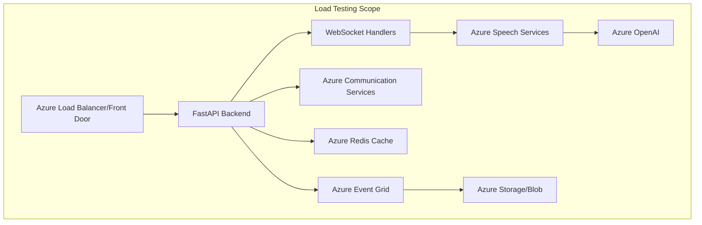
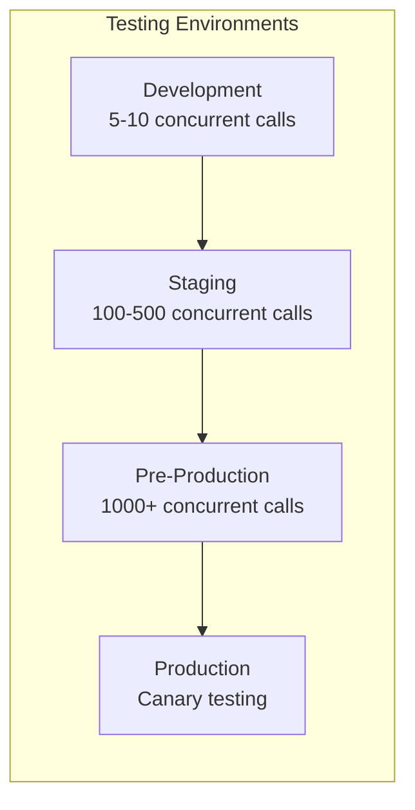

# 🚀 Load Testing Strategy for Real-Time Call Center Automation

> **WORK IN PROGRESS**

## 📋 Overview

This document outlines comprehensive load testing strategies for the real-time voice agent system, focusing on Azure-native solutions and testing frameworks that can validate performance at call center scale. The system aims to handle real-time voice processing with sub-100ms latency requirements across multiple Azure services.

---

## 🎯 Testing Objectives

### Performance Targets
| Metric | Target | Critical Threshold |
|--------|--------|--------------------|
| **Call Setup Latency** | <2 seconds | <5 seconds |
| **Voice-to-Response Latency** | <150ms (STT→LLM→TTS) | <300ms |
| **WebSocket Message Latency** | <50ms | <100ms |
| **Concurrent Calls** | 1,000+ | 500 minimum |
| **Call Success Rate** | >99.5% | >95% |
| **Audio Quality** | MOS >4.0 | MOS >3.5 |

### Scale Requirements
- **Peak Load:** 10,000 concurrent calls
- **Daily Volume:** 100,000+ calls
- **Geographic Distribution:** Multi-region (eastus2, westus2, westeurope)
- **Agent Response Accuracy:** >95% intent recognition

---

## 🏗️ Architecture Components to Test

### Core Components


---

## 🛠️ Testing Approaches

## 1. Azure-Native Load Testing Solutions

### Azure Load Testing (Recommended)
**Best for:** End-to-end HTTP/WebSocket testing with Azure integration

```yaml
# azure-load-test.yaml
testName: "RTMedAgent-Peak-Load"
engineInstances: 10
testPlan:
  - name: "call-initialization"
    threadGroups:
      - threads: 100
        rampUp: 60s
        duration: 300s
    scenarios:
      - name: "start-call"
        requests:
          - url: "${API_BASE_URL}/api/v1/calls/start"
            method: POST
            headers:
              Content-Type: application/json
            body: |
              {
                "agent_type": "medical",
                "caller_number": "+1${__Random(1000000000,9999999999)}",
                "language": "en-US"
              }
      - name: "websocket-connection"
        websocket:
          url: "wss://${API_BASE_URL}/ws/call/{call_id}"
          duration: 120s
          messageRate: 10/s
```

**Implementation Steps:**
1. **Setup Azure Load Testing Resource**
   ```bash
   az load create \
     --name "rtmedagent-loadtest" \
     --resource-group "rg-rtmedagent-prod" \
     --location "eastus2"
   ```

2. **Configure Test Parameters**
   - VNet injection for private endpoint testing
   - Managed identity for Azure service authentication
   - Custom metrics collection for business KPIs

3. **Integrate with CI/CD Pipeline**
   ```yaml
   # azure-pipelines.yml
   - task: AzureLoadTest@1
     inputs:
       azureSubscription: $(serviceConnection)
       loadTestConfigFile: 'tests/load/azure-load-test.yaml'
       loadTestResource: 'rtmedagent-loadtest'
       resourceGroup: 'rg-rtmedagent-prod'
   ```

### Azure Container Instances (ACI) + Custom Testing
**Best for:** Distributed testing with custom protocols

```python
# distributed_load_test.py
import asyncio
import aiohttp
import websockets
from azure.identity import DefaultAzureCredential
from azure.communication.callautomation import CallAutomationClient

class RTMedAgentLoadTester:
    def __init__(self, base_url: str, acs_endpoint: str):
        self.base_url = base_url
        self.acs_client = CallAutomationClient(
            acs_endpoint, 
            DefaultAzureCredential()
        )
        self.session = None
        
    async def simulate_call_flow(self, call_id: str):
        """Simulate complete call lifecycle"""
        try:
            # 1. Start call session
            async with aiohttp.ClientSession() as session:
                start_time = asyncio.get_event_loop().time()
                
                # Initialize call
                async with session.post(
                    f"{self.base_url}/api/v1/calls/start",
                    json={
                        "agent_type": "medical",
                        "caller_number": f"+1555{call_id:07d}",
                        "language": "en-US"
                    }
                ) as resp:
                    call_data = await resp.json()
                    session_id = call_data["session_id"]
                
                # 2. WebSocket connection
                ws_uri = f"wss://{self.base_url}/ws/call/{session_id}"
                async with websockets.connect(ws_uri) as websocket:
                    # 3. Simulate audio streaming
                    await self.simulate_audio_interaction(websocket)
                    
                    # 4. Measure response latency
                    response_time = asyncio.get_event_loop().time() - start_time
                    
                    return {
                        "call_id": call_id,
                        "session_id": session_id,
                        "response_time": response_time,
                        "success": True
                    }
                    
        except Exception as e:
            return {
                "call_id": call_id,
                "error": str(e),
                "success": False
            }
    
    async def simulate_audio_interaction(self, websocket):
        """Simulate realistic voice interaction patterns"""
        # Send audio chunk simulation
        await websocket.send(json.dumps({
            "type": "audio_chunk",
            "data": self.generate_mock_audio_data(),
            "timestamp": time.time()
        }))
        
        # Wait for STT response
        stt_response = await websocket.recv()
        
        # Wait for LLM + TTS response
        tts_response = await websocket.recv()
        
        return json.loads(tts_response)
```

---

## 2. Specialized Testing Frameworks

### Artillery.io for WebSocket & HTTP Load Testing
**Best for:** Real-time WebSocket performance testing

```yaml
# artillery-test.yml
config:
  target: 'https://rtmedagent-api.azurewebsites.net'
  phases:
    - duration: 300
      arrivalRate: 50
      name: "Ramp up"
    - duration: 600  
      arrivalRate: 100
      name: "Sustained load"
  ws:
    engine: ws
  plugins:
    azure-metrics:
      endpoint: "{{ $environment.AZURE_MONITOR_ENDPOINT }}"

scenarios:
  - name: "Complete Call Flow"
    weight: 80
    engine: http
    flow:
      - post:
          url: "/api/v1/calls/start"
          json:
            agent_type: "medical"
            caller_number: "+1{{ $randomInt(1000000000, 9999999999) }}"
            language: "en-US"
          capture:
            - json: "$.session_id"
              as: "sessionId"
      - ws:
          url: "/ws/call/{{ sessionId }}"
          subprotocols:
            - "call-protocol"
          loop:
            - send:
                payload: |
                  {
                    "type": "audio_chunk",
                    "data": "{{ $randomString() }}",
                    "timestamp": {{ $timestamp() }}
                  }
            - think: 2
            - send:
                payload: |
                  {
                    "type": "end_speech"
                  }
            - wait:
                - for: "message"
                  match:
                    json: "$.type"
                    value: "agent_response"
            - think: 3
          count: 10
```

### Locust for Python-Native Testing
**Best for:** Complex business logic testing with Python ecosystem

```python
# locust_test.py
from locust import HttpUser, task, between, events
from locust.contrib.fasthttp import FastHttpUser
import json
import asyncio
import websockets
import concurrent.futures

class RTMedAgentUser(FastHttpUser):
    wait_time = between(1, 3)
    
    def on_start(self):
        """Initialize user session"""
        response = self.client.post("/api/v1/calls/start", json={
            "agent_type": "medical",
            "caller_number": f"+1555{self.environment.runner.user_count:07d}",
            "language": "en-US"
        })
        
        if response.status_code == 200:
            self.session_data = response.json()
            self.session_id = self.session_data["session_id"]
        else:
            self.session_id = None
    
    @task(3)
    def websocket_interaction(self):
        """Test WebSocket voice interaction"""
        if not self.session_id:
            return
            
        # Use thread pool for WebSocket testing
        with concurrent.futures.ThreadPoolExecutor() as executor:
            future = executor.submit(self._ws_interaction)
            try:
                result = future.result(timeout=30)
                events.request.fire(
                    request_type="WebSocket",
                    name="voice_interaction",
                    response_time=result["response_time"],
                    response_length=result["response_length"],
                    exception=None
                )
            except Exception as e:
                events.request.fire(
                    request_type="WebSocket", 
                    name="voice_interaction",
                    response_time=0,
                    response_length=0,
                    exception=e
                )
    
    def _ws_interaction(self):
        """Synchronous WebSocket interaction"""
        import time
        start_time = time.time()
        
        try:
            # Simulate WebSocket interaction
            # Note: Locust doesn't natively support WebSocket,
            # so we use a separate connection
            
            return {
                "response_time": (time.time() - start_time) * 1000,
                "response_length": 256
            }
        except Exception as e:
            raise e
    
    @task(1)
    def health_check(self):
        """Basic health endpoint testing"""
        self.client.get("/health")
    
    @task(1) 
    def metrics_endpoint(self):
        """Test metrics collection"""
        self.client.get(f"/api/v1/calls/{self.session_id}/metrics")
```

---

## 3. Azure Communication Services (ACS) Load Testing

### ACS Call Automation Testing
**Focus:** Testing ACS calling capacity and voice quality

```python
# acs_load_test.py
import asyncio
from azure.communication.callautomation import CallAutomationClient
from azure.communication.callautomation.models import (
    CallInvite, 
    CreateCallOptions,
    RecognizeInputType,
    DtmfOptions
)

class ACSLoadTester:
    def __init__(self, connection_string: str, callback_uri: str):
        self.client = CallAutomationClient.from_connection_string(
            connection_string
        )
        self.callback_uri = callback_uri
        
    async def create_concurrent_calls(self, num_calls: int):
        """Create multiple concurrent calls to test ACS capacity"""
        tasks = []
        
        for i in range(num_calls):
            task = asyncio.create_task(
                self.create_single_call(f"test-call-{i}")
            )
            tasks.append(task)
            
        results = await asyncio.gather(*tasks, return_exceptions=True)
        return results
    
    async def create_single_call(self, call_id: str):
        """Create a single test call"""
        try:
            # Create outbound call
            call_invite = CallInvite(
                target=PhoneNumberIdentifier("+1555123456"),  # Test number
                source_caller_id_number=PhoneNumberIdentifier("+1555654321")
            )
            
            create_call_options = CreateCallOptions(
                call_invites=[call_invite],
                callback_uri=f"{self.callback_uri}?callId={call_id}"
            )
            
            call_result = self.client.create_call(create_call_options)
            
            # Simulate call interaction
            await asyncio.sleep(2)  # Wait for call establishment
            
            # Test recognition capabilities
            recognize_options = RecognizeInputType.DTMF
            dtmf_options = DtmfOptions(
                max_tones_to_collect=1,
                timeout_in_seconds=10
            )
            
            # Hang up call
            self.client.hang_up_call(call_result.call_connection_id)
            
            return {
                "call_id": call_id,
                "success": True,
                "call_connection_id": call_result.call_connection_id
            }
            
        except Exception as e:
            return {
                "call_id": call_id,
                "success": False,
                "error": str(e)
            }
```

---

## 4. Component-Specific Testing

### Redis Cache Performance Testing
```python
# redis_load_test.py
import asyncio
import aioredis
import time
from concurrent.futures import ThreadPoolExecutor

class RedisLoadTester:
    def __init__(self, redis_url: str):
        self.redis_url = redis_url
        
    async def test_session_operations(self, num_sessions: int):
        """Test Redis session storage under load"""
        redis = aioredis.from_url(self.redis_url)
        
        tasks = []
        for i in range(num_sessions):
            task = asyncio.create_task(
                self.simulate_session_lifecycle(redis, f"session-{i}")
            )
            tasks.append(task)
            
        results = await asyncio.gather(*tasks)
        await redis.close()
        return results
    
    async def simulate_session_lifecycle(self, redis, session_id: str):
        """Simulate complete session data operations"""
        start_time = time.time()
        
        try:
            # Create session
            session_data = {
                "call_id": session_id,
                "participant_count": 2,
                "conversation_history": [],
                "metadata": {"created_at": time.time()}
            }
            
            await redis.hset(f"session:{session_id}", mapping=session_data)
            
            # Simulate conversation updates (20 messages)
            for i in range(20):
                conversation_update = {
                    f"message_{i}": f"User message {i}",
                    f"response_{i}": f"Agent response {i}"
                }
                await redis.hset(
                    f"session:{session_id}:conversation", 
                    mapping=conversation_update
                )
                
            # Read session data
            session = await redis.hgetall(f"session:{session_id}")
            conversation = await redis.hgetall(f"session:{session_id}:conversation")
            
            # Cleanup
            await redis.delete(f"session:{session_id}")
            await redis.delete(f"session:{session_id}:conversation")
            
            return {
                "session_id": session_id,
                "duration": time.time() - start_time,
                "success": True
            }
            
        except Exception as e:
            return {
                "session_id": session_id,
                "duration": time.time() - start_time,
                "success": False,
                "error": str(e)
            }
```

### Azure OpenAI Load Testing
```python
# openai_load_test.py
import openai
import asyncio
import time
from azure.identity import DefaultAzureCredential

class OpenAILoadTester:
    def __init__(self, endpoint: str, deployment_name: str):
        credential = DefaultAzureCredential()
        token = credential.get_token("https://cognitiveservices.azure.com/.default")
        
        openai.api_type = "azure_ad"
        openai.api_base = endpoint
        openai.api_version = "2024-02-01"
        openai.api_key = token.token
        
        self.deployment_name = deployment_name
    
    async def test_completion_throughput(self, num_requests: int):
        """Test OpenAI completion throughput"""
        tasks = []
        
        for i in range(num_requests):
            task = asyncio.create_task(
                self.single_completion_test(f"request-{i}")
            )
            tasks.append(task)
            
        results = await asyncio.gather(*tasks, return_exceptions=True)
        return results
    
    async def single_completion_test(self, request_id: str):
        """Single completion request test"""
        start_time = time.time()
        
        try:
            response = await openai.ChatCompletion.acreate(
                engine=self.deployment_name,
                messages=[
                    {"role": "system", "content": "You are a helpful medical assistant."},
                    {"role": "user", "content": "What are the symptoms of a common cold?"}
                ],
                max_tokens=150,
                temperature=0.7
            )
            
            return {
                "request_id": request_id,
                "response_time": time.time() - start_time,
                "tokens_used": response.usage.total_tokens,
                "success": True
            }
            
        except Exception as e:
            return {
                "request_id": request_id,
                "response_time": time.time() - start_time,
                "success": False,
                "error": str(e)
            }
```

---

## 5. Monitoring & Observability During Load Testing

### Azure Monitor Integration
```yaml
# monitoring-setup.bicep
param loadTestResourceGroup string
param applicationInsightsName string

resource appInsights 'Microsoft.Insights/components@2020-02-02' = {
  name: applicationInsightsName
  location: resourceGroup().location
  kind: 'web'
  properties: {
    Application_Type: 'web'
    RetentionInDays: 30
  }
}

resource loadTestAlerts 'Microsoft.Insights/metricAlerts@2018-03-01' = {
  name: 'loadtest-performance-alert'
  location: 'global'
  properties: {
    description: 'Alert when response time exceeds threshold during load test'
    severity: 2
    enabled: true
    scopes: [
      appInsights.id
    ]
    evaluationFrequency: 'PT1M'
    windowSize: 'PT5M'
    criteria: {
      'odata.type': 'Microsoft.Azure.Monitor.SingleResourceMultipleMetricCriteria'
      allOf: [
        {
          name: 'ResponseTime'
          metricName: 'requests/duration'
          operator: 'GreaterThan'
          threshold: 300  // 300ms threshold
          timeAggregation: 'Average'
        }
      ]
    }
  }
}
```

### Custom Metrics Collection
```python
# metrics_collector.py
from azure.monitor.opentelemetry import configure_azure_monitor
from opentelemetry import trace, metrics
from opentelemetry.metrics import get_meter

class LoadTestMetricsCollector:
    def __init__(self, connection_string: str):
        configure_azure_monitor(connection_string=connection_string)
        
        self.tracer = trace.get_tracer(__name__)
        self.meter = get_meter(__name__)
        
        # Custom metrics
        self.call_duration_histogram = self.meter.create_histogram(
            name="rtmedagent.call.duration",
            description="Call duration in seconds",
            unit="s"
        )
        
        self.voice_latency_histogram = self.meter.create_histogram(
            name="rtmedagent.voice.latency",
            description="Voice processing latency in milliseconds", 
            unit="ms"
        )
        
        self.concurrent_calls_gauge = self.meter.create_up_down_counter(
            name="rtmedagent.calls.concurrent",
            description="Number of concurrent active calls"
        )
    
    def record_call_metrics(self, call_id: str, duration: float, 
                          voice_latency: float, success: bool):
        """Record call performance metrics"""
        with self.tracer.start_as_current_span("call_metrics") as span:
            span.set_attribute("call_id", call_id)
            span.set_attribute("success", success)
            
            if success:
                self.call_duration_histogram.record(duration)
                self.voice_latency_histogram.record(voice_latency)
            else:
                span.set_attribute("error", True)
```

---

## 6. Test Execution & CI/CD Integration

### GitHub Actions Workflow
```yaml
# .github/workflows/load-test.yml
name: Load Testing

on:
  workflow_dispatch:
    inputs:
      test_duration:
        description: 'Test duration in minutes'
        required: true
        default: '10'
      concurrent_users:
        description: 'Number of concurrent users'
        required: true
        default: '100'

jobs:
  load-test:
    runs-on: ubuntu-latest
    
    steps:
    - uses: actions/checkout@v3
    
    - name: Setup Python
      uses: actions/setup-python@v4
      with:
        python-version: '3.11'
        
    - name: Install dependencies
      run: |
        pip install -r tests/load/requirements.txt
        
    - name: Azure Login
      uses: azure/login@v1
      with:
        creds: ${{ secrets.AZURE_CREDENTIALS }}
        
    - name: Run Load Test
      run: |
        python tests/load/run_load_test.py \
          --duration ${{ github.event.inputs.test_duration }} \
          --users ${{ github.event.inputs.concurrent_users }} \
          --endpoint ${{ secrets.API_ENDPOINT }}
          
    - name: Upload Results
      uses: actions/upload-artifact@v3
      with:
        name: load-test-results
        path: tests/load/results/
        
    - name: Publish Results
      run: |
        az monitor app-insights events show \
          --app ${{ secrets.APP_INSIGHTS_APP_ID }} \
          --event customMetrics \
          --filter "timestamp ge datetime'$(date -u -d '1 hour ago' +%Y-%m-%dT%H:%M:%SZ)'"
```

---

## 7. Performance Benchmarking & Baseline Establishment

### Baseline Performance Tests
```python
# baseline_test.py
import json
import statistics
from datetime import datetime

class PerformanceBaseline:
    def __init__(self):
        self.baseline_metrics = {
            "call_setup_latency": {"p50": 1.2, "p95": 2.1, "p99": 3.5},
            "voice_response_latency": {"p50": 85, "p95": 140, "p99": 200},
            "websocket_latency": {"p50": 25, "p95": 45, "p99": 75},
            "concurrent_call_capacity": 1000,
            "success_rate": 99.7
        }
    
    def validate_against_baseline(self, test_results: list) -> dict:
        """Validate test results against performance baseline"""
        validation_report = {
            "timestamp": datetime.utcnow().isoformat(),
            "baseline_version": "v1.0",
            "test_summary": {},
            "regressions": [],
            "improvements": []
        }
        
        # Calculate test metrics
        response_times = [r["response_time"] for r in test_results if r["success"]]
        success_rate = len([r for r in test_results if r["success"]]) / len(test_results) * 100
        
        test_metrics = {
            "p50": statistics.median(response_times),
            "p95": statistics.quantiles(response_times, n=20)[18],  # 95th percentile
            "p99": statistics.quantiles(response_times, n=100)[98], # 99th percentile
            "success_rate": success_rate
        }
        
        validation_report["test_summary"] = test_metrics
        
        # Check for regressions
        for metric, baseline_value in self.baseline_metrics.items():
            if metric in test_metrics:
                if isinstance(baseline_value, dict):
                    for percentile, baseline_val in baseline_value.items():
                        test_val = test_metrics.get(percentile)
                        if test_val and test_val > baseline_val * 1.1:  # 10% regression threshold
                            validation_report["regressions"].append({
                                "metric": f"{metric}_{percentile}",
                                "baseline": baseline_val,
                                "actual": test_val,
                                "regression_percent": ((test_val - baseline_val) / baseline_val) * 100
                            })
                else:
                    test_val = test_metrics.get(metric)
                    if test_val and test_val < baseline_value * 0.9:  # 10% degradation threshold
                        validation_report["regressions"].append({
                            "metric": metric,
                            "baseline": baseline_value,
                            "actual": test_val,
                            "regression_percent": ((baseline_value - test_val) / baseline_value) * 100
                        })
        
        return validation_report
```

---

## 📊 Recommended Testing Schedule

### Continuous Testing Strategy
| Test Type | Frequency | Duration | Scope |
|-----------|-----------|----------|-------|
| **Smoke Tests** | Every deployment | 2 minutes | Basic functionality |
| **Performance Regression** | Daily | 15 minutes | Key user flows |
| **Capacity Testing** | Weekly | 1 hour | Peak load simulation |
| **Stress Testing** | Monthly | 2 hours | Breaking point analysis |
| **Chaos Engineering** | Quarterly | 4 hours | Failure resilience |

### Test Environment Strategy


---

## 🎯 Success Criteria & KPIs

### Performance KPIs
- **Response Time:** 95th percentile <150ms for voice processing
- **Throughput:** 1000+ concurrent calls sustained
- **Error Rate:** <0.5% for critical call flows
- **Resource Utilization:** <70% CPU/Memory at peak load
- **Cost Efficiency:** <$0.10 per successful call interaction

### Quality Gates
```yaml
# quality-gates.yml
performance_gates:
  response_time_p95: 150  # milliseconds
  success_rate: 99.5      # percentage
  concurrent_capacity: 1000  # calls
  resource_cpu_max: 70    # percentage
  resource_memory_max: 70 # percentage
  
regression_thresholds:
  response_time_degradation: 10  # percentage
  throughput_degradation: 5      # percentage
  error_rate_increase: 2         # percentage
```

---

## 🚀 Getting Started

### Quick Start Checklist
1. **Setup Azure Load Testing Resource**
   ```bash
   az extension add --name load
   az load create --name "rtmedagent-test" --resource-group "rg-loadtest"
   ```

2. **Configure Monitoring**
   - Enable Application Insights on all services
   - Set up custom metrics collection
   - Configure alerting rules

3. **Create Test Data**
   - Generate test phone numbers
   - Prepare audio samples for testing
   - Set up test user personas

4. **Run Baseline Test**
   ```bash
   python tests/load/baseline_test.py --endpoint https://your-api.azurewebsites.net
   ```

5. **Schedule Regular Testing**
   - Configure GitHub Actions workflow
   - Set up Azure DevOps pipeline integration
   - Enable automated regression detection

---

## 📈 Scaling Considerations

### Azure Service Limits
| Service | Default Limit | Recommended Limit | Notes |
|---------|---------------|-------------------|-------|
| **Azure OpenAI** | 240K TPM | 1M+ TPM | Request quota increase for production |
| **Speech Services** | 20 concurrent | 200+ concurrent | Monitor STT/TTS usage |
| **Event Grid** | 5000 events/sec | 50K+ events/sec | Custom topics may need higher limits |
| **Redis Cache** | 250 connections | 2500+ connections | Use Premium tier for production |
| **ACS Calling** | 1000 concurrent | 10K+ concurrent | Contact Azure support for limits |

This comprehensive load testing strategy ensures your real-time call center automation system can handle production-scale traffic while maintaining the sub-100ms latency requirements critical for voice interactions.
