# 🎛️ ACS Media Streaming and Barge-In Flow

This document provides a comprehensive visual representation of how the ACS Media Handler manages real-time audio streaming, speech recognition, and intelligent barge-in functionality for seamless voice interactions.

## 🔄 Overall Communication Flow
```
┌─────────────────────────────────────────────────────────────┐
│ Azure Speech SDK Thread (Background)                        │
│ ┌─────────────────────────────────────────────────────────┐ │
│ │ Speech Recognition Loop (SDK Internal)                  │ │
│ │ • Processes audio continuously                          │ │
│ │ • Fires callbacks: on_partial(), on_final()             │ │
│ └─────────────────────────────────────────────────────────┘ │
└─────────────────────────────────────────────────────────────┘
                               │
                               │ Callbacks bridge to main loop
                               ▼
┌─────────────────────────────────────────────────────────────┐
│ Main Event Loop (FastAPI/uvicorn)                           │
│                                                             │
│ ┌─────────────────────────────────────────────────────────┐ │
│ │ route_turn_loop() - The Main Processing Loop            │ │
│ │ • Waits for speech results from queue                   │ │
│ │ • Manages AI response playback tasks                    │ │
│ │ • Handles cancellation and task lifecycle               │ │
│ └─────────────────────────────────────────────────────────┘ │
│                                                             │
│ ┌─────────────────────────────────────────────────────────┐ │
│ │ playback_task (Created per AI response)                 │ │
│ │ • route_and_playback() - Processes speech with AI       │ │
│ │ • Can be cancelled by barge-in                          │ │
│ └─────────────────────────────────────────────────────────┘ │
└─────────────────────────────────────────────────────────────┘
```

## 🔄 Asynchronous Task Architecture

### 🎯 Three Core Processing Loops

#### 1. **Main Event Loop** (`route_turn_loop`)
```python
async def route_turn_loop():
    """Background task that processes finalized speech"""
    while True:
        # Blocks until final speech is available
        speech_result = await self.route_turn_queue.get()
        
        # Cancel any existing AI response
        if self.playback_task and not self.playback_task.done():
            self.playback_task.cancel()
        
        # Create new AI processing task
        self.playback_task = asyncio.create_task(
            self.route_and_playback(speech_result)
        )
```

#### 2. **Speech Recognition Thread** (Azure SDK Background)
```python
# SDK callbacks bridge to main event loop
def on_partial(text, confidence, language):
    """Immediate barge-in trigger - synchronous callback"""
    if self.playback_task:
        self.playback_task.cancel()  # Immediate cancellation
    self.send_stop_audio_command()

def on_final(text, confidence, language):
    """Queue final speech for AI processing"""
    try:
        self.route_turn_queue.put_nowait(speech_result)
    except asyncio.QueueFull:
        # Handle queue overflow gracefully
```

#### 3. **Playback Task** (`route_and_playback`)
```python
async def route_and_playback(speech_result):
    """Individual task for each AI response - can be cancelled"""
    try:
        # Process with AI agent
        response = await self.ai_agent.process(speech_result.text)
        
        # Generate and stream audio
        async for audio_chunk in self.tts_service.generate(response):
            await self.send_audio_to_acs(audio_chunk)
            
    except asyncio.CancelledError:
        # Clean cancellation from barge-in
        logger.info("🛑 Playback task cancelled by barge-in")
        raise  # Re-raise to complete cancellation
```

### ⚡ Barge-In Flow Interaction

1. **User Speaks During AI Response**
   - `on_partial()` callback fires immediately (< 10ms)
   - Synchronous cancellation of `playback_task`
   - Stop audio command sent to ACS

2. **Task Cancellation Chain**
   ```
   on_partial() → playback_task.cancel() → CancelledError raised
                                        → Clean task cleanup
                                        → ACS stops audio output
   ```

3. **New Speech Processing**
   - `on_final()` queues completed speech
   - `route_turn_loop` picks up queued speech
   - New `playback_task` created for fresh AI response

### 🔄 Queue-Based Serialization

The `route_turn_queue` ensures:
- **Sequential Processing**: Only one AI response generated at a time
- **Backpressure Handling**: Prevents memory overflow during rapid speech
- **Clean State Management**: Clear separation between speech input and AI processing

This architecture provides **sub-50ms barge-in response time** while maintaining clean async task lifecycle management.

```mermaid
sequenceDiagram
    participant User as 👤 User
    participant SR as 🎤 Speech Recognizer
    participant Handler as 🎛️ ACS Media Handler
    participant BG as 🔄 Background Playback Task
    participant ACS as 🔊 Azure Communication Services

    Note over User,ACS: ⚡ Real-Time Barge-In Sequence
    
    rect rgb(255, 235, 235)
    Note over User,ACS: 🎵 AI is currently playing audio response
    BG->>ACS: 🔊 Streaming TTS Audio
    end
    
    rect rgb(255, 210, 210)
    Note over User,Handler: 🚨 USER INTERRUPTS WITH SPEECH
    User->>+SR: 🗣️ Speaks (Partial Audio Detected)
    SR->>Handler: ⚡ on_partial(text, lang) callback
    end
    
    rect rgb(255, 180, 180)
    Note over Handler: 🛑 IMMEDIATE BARGE-IN ACTIONS
    Handler->>BG: ❌ playback_task.cancel()
    Handler->>Handler: 🔄 asyncio.create_task(handle_barge_in)
    Handler->>ACS: 🛑 Send {"Kind": "StopAudio"} command
    end
    
    rect rgb(200, 255, 200)
    BG-->>Handler: ✅ Task Cancelled Successfully
    ACS-->>User: 🔇 Audio Playback Stopped
    Note right of BG: Previous AI response interrupted cleanly
    end
    
    rect rgb(235, 235, 255)
    Note over User,Handler: 📝 User continues speaking...
    User->>SR: 🗣️ Continues Speaking (Final Recognition)
    SR->>Handler: 📋 on_final(text, lang) callback
    Handler->>Handler: 📋 route_turn_queue.put_nowait()
    end
    
    rect rgb(220, 255, 220)
    Note over Handler,ACS: 🤖 New AI Response Generation
    Handler->>ACS: 🔊 Send New Audio Response
    ACS->>User: 🎵 Play New Response
    end
    
    deactivate SR
```



## 🔄 State Management and Background Task Lifecycle


## 🔧 Key Implementation Details

### 🚨 Barge-In Detection
- **Trigger**: `on_partial` callback from Speech Recognizer detects user speech
- **Immediate Action**: Synchronous cancellation of `playback_task` using `asyncio.Task.cancel()`
- **Stop Signal**: Send `{"Kind": "StopAudio", "StopAudio": {}}` JSON command to ACS via WebSocket
- **Logging**: Comprehensive logging with emojis for real-time debugging

### 🔄 Async Background Task Management
- **Route Turn Queue**: Serializes final speech processing using `asyncio.Queue()`
- **Playback Task**: Tracks current AI response generation/playback with `self.playback_task`
- **Task Lifecycle**: Clean creation, cancellation, and cleanup of background tasks
- **Cancellation Safety**: Proper `try/except asyncio.CancelledError` handling

### 🛑 Stop Audio Signal Protocol
```json
{
  "Kind": "StopAudio",
  "AudioData": null,
  "StopAudio": {}
}
```
This JSON message is sent to ACS to immediately halt any ongoing audio playback.

### ⚡ Error Handling & Resilience
- **Event Loop Detection**: Graceful handling when no event loop is available
- **WebSocket Validation**: Connection state checks before sending messages
- **Task Cancellation**: Proper cleanup with `await task` after cancellation
- **Queue Management**: Full queue detection and message dropping strategies

### 📊 Performance Optimizations
- **Immediate Cancellation**: Barge-in triggers instant playback stop (< 50ms)
- **Background Processing**: Non-blocking AI response generation
- **Memory Management**: Proper task cleanup prevents memory leaks
- **Concurrent Safety**: Thread-safe queue operations for speech processing
