# :material-cube-outline: Architecture Overview

!!! abstract "Real-Time Voice AI Accelerator"
    Azure Communication Services voice agent accelerator with modular AI agents, real-time audio processing, and enterprise deployment patterns.

## :material-view-dashboard: Core Capabilities

| Feature | What's Included | Purpose |
|---------|-----------------|---------|
| **Real-time Audio** | ACS + Speech Services integration | Voice conversation processing |
| **AI Agent Framework** | Modular, swappable agent system | Industry-specific implementations |
| **Intelligent Barge-in** | Voice activity detection patterns | Natural conversation flow |
| **Serverless Scaling** | Container Apps with auto-scaling | Cost-effective, elastic hosting |
| **Development Ready** | Public endpoints with managed identity | Quick deployment and testing |

!!! abstract "Deployment Architecture Options"
    **Current Terraform**: Container Apps with public endpoints for rapid development
    
    **Available Bicep**: Enterprise production architecture with API Gateway, private networking, and advanced cost optimization

## :material-map: Architecture Views

=== "🏗️ Infrastructure"
    **Azure deployment** with auto-scaling, security, and monitoring
    
    - Container Apps with KEDA scaling
    - Private networking (optional)
    - API Management with AI Gateway
    - Multi-region capabilities

=== "🧩 Components"
    **Application architecture** with modular agents
    
    - Plug-and-play AI agent framework
    - Industry-specific implementations
    - Event-driven processing
    - Real-time state management

=== "📊 Data Flow"
    **Processing patterns** for voice and chat
    
    - Three-tier storage (Memory/Redis/Cosmos)
    - Event-driven architecture
    - Real-time transcription pipeline

!!! tip "Industry Focus"
    Supports healthcare, insurance, legal, and customer support agents with unified Azure Communication Services integration.

## :material-cloud-outline: Deployment Architecture


*Azure infrastructure with Container Apps, AI Foundry, and public endpoints*

!!! info "Microsoft Learn Resources"
    - **[Azure Communication Services](https://learn.microsoft.com/en-us/azure/communication-services/overview)** - Core platform
    - **[Audio Streaming Concepts](https://learn.microsoft.com/en-us/azure/communication-services/concepts/call-automation/audio-streaming-concept)** - Real-time media
    - **[Container Apps](https://learn.microsoft.com/en-us/azure/container-apps/overview)** - Serverless hosting

!!! warning "Current Terraform Deployment"
    **Simplified Public Infrastructure** - The Terraform deployment creates a streamlined development-focused architecture with public endpoints and Container Apps hosting. Advanced features like API Management, AI Gateway, private networking, and Application Gateway are available in the Bicep templates for production scenarios.

## :material-network: Key Infrastructure Components

=== "Core Services (Terraform Deployed)"
    **Container Apps Environment:**
    
    - **Auto-scaling** - KEDA-based scaling for frontend and backend containers
    - **Public Ingress** - External endpoints for development and testing
    - **Managed Identity** - Azure AD authentication across all services
    - **Application Insights** - Centralized logging and monitoring
    
    **AI Services:**
    
    - **Azure AI Foundry** - Model hosting with GPT-4o deployment
    - **Speech Services** - Real-time STT/TTS with ACS integration
    - **Cognitive Services** - Managed identity authentication
    
    **Data Layer:**
    
    - **Cosmos DB (MongoDB API)** - Session and conversation storage
    - **Redis Enterprise** - High-performance caching with RBAC
    - **Storage Account** - Audio files and prompt storage
    - **Key Vault** - Secure secret management

=== "Production Extensions (Bicep Available)"
    **Advanced Networking:**
    
    - Hub-spoke VNet topology with private endpoints
    - Application Gateway with WAF protection  
    - NSG rules and traffic control
    
    **API Management & AI Gateway:**
    
    - Token management and PTU optimization
    - Load balancing and cost analytics
    - Content safety and multi-region routing
    
    !!! info "Deployment Comparison"
        **Terraform**: Streamlined development infrastructure with public endpoints and Container Apps
        
        **Bicep**: Enterprise-grade production architecture with private networking, API Gateway, and Application Gateway
        
        **Microsoft Learn References:**
        
        - **[Container Apps Architecture](https://learn.microsoft.com/en-us/azure/container-apps/overview)** - Serverless hosting patterns
        - **[AI Gateway Architecture](https://learn.microsoft.com/en-us/ai/playbook/technology-guidance/generative-ai/dev-starters/genai-gateway/reference-architectures/apim-based)** - Advanced API management (Bicep only)
        - **[Private Endpoint Integration](https://learn.microsoft.com/en-us/azure/container-apps/networking)** - Network security patterns (Bicep only)

---

## Multi-Agent Orchestration Architecture

**Central Orchestration Hub:**

The **Agent Orchestrator** coordinates multi-agent workflows through simple function-based dependency injection:

- **🎯 Intent Routing** - Analyzes requests and selects appropriate specialized agents
- **🔄 Multi-Pattern Support** - Sequential handoffs, parallel consultation, expert escalation  
- **📝 State Management** - Real-time conversation context via Redis cache
- **🔊 Response Coordination** - Unified TTS output through Azure Speech Services

**Simple Dependency Injection Pattern:**

```python
# orchestrator.py - Clean dependency provider
def get_orchestrator() -> callable:
    """FastAPI dependency provider for conversation orchestrator."""
    return route_conversation_turn

# media.py - Usage in WebSocket endpoint  
@router.websocket("/stream")
async def acs_media_stream(websocket: WebSocket) -> None:
    orchestrator = get_orchestrator()  # Simple function injection
    
    handler = await _create_media_handler(
        websocket=websocket,
        orchestrator=orchestrator,  # Pass orchestrator function
        call_connection_id=call_connection_id,
        # ... other params
    )
```

**Plug-and-Play Architecture:**

The orchestrator injection enables easy swapping of conversation logic:

```python
# Switch orchestration strategies by changing the dependency provider
def get_orchestrator() -> callable:
    # return route_conversation_turn        # Default ARTAgent routing
    # return route_turn_for_fnol           # Insurance-specific routing  
    # return custom_conversation_handler   # Custom business logic
    return route_conversation_turn
```

**Processing Flow:** `Voice Input → ACS → Speech STT → Orchestrator → Specialized Agents → AI Foundry → TTS → User`

```mermaid
flowchart TB
    %% Input Layer
    subgraph Input ["🎤 Voice Input"]
        Phone[📞 Phone Calls]
        WebApp[💻 Web Interface]
    end
    
    %% Azure Services Layer  
    subgraph Azure ["⚡ Azure Real-Time Services"]
        ACS[Azure Communication Services<br/>📡 Call Management]
        Speech[Azure Speech Services<br/>🗣️ STT/TTS Processing]
    end
    
    %% Custom Multi-Agent Orchestration Framework
    subgraph Orchestration ["🎭 Custom Multi-Agent Orchestration Framework"]
        Orchestrator[🎯 Agent Orchestrator<br/>• Multi-pattern coordination<br/>• Intent routing & handoffs<br/>• Context preservation<br/>• Real-time state sync]
                
        subgraph AgentPool ["🤖 Specialized Agent Pool"]
            Healthcare["🏥 Healthcare<br/>GPT-5 | Emma Voice<br/>Medical + HIPAA tools"]
            Insurance["📊 Insurance<br/>o3-mini | Brian Voice<br/>Claims + Policy tools"]
            Legal["⚖️ Legal<br/>GPT-5 | Steffan Voice<br/>Contract + Compliance tools"]

            %% Agent coordination patterns
            Healthcare -.->|"Sequential Handoff"| Legal
            Healthcare -.->|"Parallel Consult"| Insurance
            Legal -.->|"Expert Escalation"| Insurance
        end

        AIFoundry["🚀 Azure AI Foundry<br/>Model hosting & orchestration"]

    end
    
    %% State Layer (implied usage, no explicit connections)
    subgraph StateLayer ["💾 State Management (Used by Orchestrator)"]
        Redis[⚡ Redis Cluster<br/>Agent contexts & workflows]
        Cosmos[📚 Cosmos DB<br/>Interaction patterns & analytics]
    end
    
    %% Core Flow (simplified)
    Input --> Azure
    
    %% Essential Connections Only
    ACS <--> Speech
    Speech <--> Orchestrator
    Orchestrator <--> AgentPool
    AgentPool <--> AIFoundry
    
    %% Styling
    classDef input fill:#e8f5e8,stroke:#4caf50,stroke-width:2px
    classDef azure fill:#e3f2fd,stroke:#2196f3,stroke-width:2px
    classDef orchestration fill:#fff8e1,stroke:#ff9800,stroke-width:3px
    classDef agent fill:#f3e5f5,stroke:#9c27b0,stroke-width:2px
    classDef storage fill:#f9f9f9,stroke:#757575,stroke-width:1px
    
    class Input,Phone,WebApp input
    class Azure,ACS,Speech azure
    class Orchestration,Orchestrator,AIFoundry orchestration
    class AgentPool,AuthAgent,FNOLAgent,CustomerAgent agent
    class StateLayer,Redis,Cosmos storage
```



## Real-Time Event Processing

The **V1 Event Processor** provides the foundational event-driven architecture for real-time voice interactions:

```mermaid
flowchart TD
    %% Event Sources
    ACS[📞 ACS Call Events] --> CloudEvent[☁️ CloudEvent]
    API[🌐 API Calls] --> CloudEvent
    
    %% V1 Event Processor Core
    CloudEvent --> Processor{🎯 V1 Event Processor}
    Processor --> Extract[🔍 Extract CallConnectionId]
    Extract --> Context[📋 Create Event Context]
    
    %% Handler Registration & Routing
    Context --> Route[🚦 Route by Event Type]
    Route --> CallHandlers[📞 Call Lifecycle Handlers]
    Route --> DTMFHandlers[🔢 DTMF Validation Handlers]
    Route --> MediaHandlers[🎵 Media Play/Recognition]
    
    %% Core Processing Flows
    CallHandlers --> StateUpdate[🔄 Update Call State]
    DTMFHandlers --> Validation[✅ AWS Connect Simulation]
    MediaHandlers --> PlayGreeting[🎵 Play Greeting/Prompts]
    
    %% State & Communication
    StateUpdate --> Redis[(⚡ Redis)]
    StateUpdate --> Broadcast[📡 WebSocket Broadcast]
    Validation --> Orchestrator[🤖 Agent Orchestrator]
    Orchestrator --> TTS[🔊 Text-to-Speech]
    TTS --> ACSStream[📺 ACS Media Stream]
    
    %% Styling
    classDef event fill:#e8f5e8,stroke:#4caf50,stroke-width:2px
    classDef processor fill:#e3f2fd,stroke:#2196f3,stroke-width:2px
    classDef handler fill:#fff3e0,stroke:#ff9800,stroke-width:2px
    classDef storage fill:#f3e5f5,stroke:#9c27b0,stroke-width:2px
    classDef output fill:#ffebee,stroke:#f44336,stroke-width:2px
    
    class ACS,API,CloudEvent event
    class Processor,Extract,Context,Route processor
    class CallHandlers,DTMFHandlers,MediaHandlers,StateUpdate,Validation,PlayGreeting handler
    class Redis storage
    class Broadcast,Orchestrator,TTS,ACSStream output
```



### V1 Event Processor Implementation

!!! info "Simplified Azure Pattern Implementation"
    The V1 Event Processor follows Azure's **CallAutomationEventProcessor** pattern but simplified for accelerator needs, focusing on call correlation and direct handler registration without complex middleware.

**Core Features:**

- **Call Correlation** - Automatic tracking by `callConnectionId`
- **CloudEvent Processing** - Standard Azure event format handling
- **Direct Handler Registration** - Simple event type → handler mapping
- **Error Isolation** - Individual handler failures don't affect others
- **OpenTelemetry Tracing** - Comprehensive observability with span correlation

**Event Flow Pattern:**
```python
# 1. CloudEvent received from ACS webhook
# 2. Extract callConnectionId for correlation
# 3. Create CallEventContext with dependencies
# 4. Route to registered handlers by event type
# 5. Execute handlers with error isolation
# 6. Update metrics and state tracking
```

### Supported Event Types

| **Category** | **ACS Event Types** | **Handler** |
|-------------|-------------------|-------------|
| **Call Lifecycle** | `CallConnected`, `CallDisconnected` | Core connection management |
| **Call Failures** | `CreateCallFailed`, `AnswerCallFailed` | Error handling and logging |
| **Participant Management** | `ParticipantsUpdated` | DTMF setup and tracking |
| **DTMF Processing** | `ContinuousDtmfRecognitionToneReceived` | AWS Connect validation simulation |
| **Media Operations** | `PlayCompleted`, `PlayFailed` | Greeting and prompt management |
| **Recognition** | `RecognizeCompleted`, `RecognizeFailed` | STT result processing |

!!! info "Azure Communication Services Event Reference"
    **Event Processing Documentation:**
    
    - **[Call Automation Events Overview](https://learn.microsoft.com/en-us/azure/communication-services/concepts/call-automation/call-automation#events)** - Complete list of webhook events and Event Grid events
    - **[Handle Events with Event Processor](https://learn.microsoft.com/en-us/azure/communication-services/how-tos/call-automation/handle-events-with-event-processor)** - CloudEvent processing patterns and correlation
    - **[Continuous DTMF Recognition](https://learn.microsoft.com/en-us/azure/communication-services/how-tos/call-automation/control-mid-call-media-actions#continuous-dtmf-recognition)** - DTMF tone detection and sequencing
    - **[Media Play Actions](https://learn.microsoft.com/en-us/azure/communication-services/how-tos/call-automation/play-action#handle-play-action-event-updates)** - PlayCompleted, PlayFailed, PlayCanceled events
    - **[Recognition Actions](https://learn.microsoft.com/en-us/azure/communication-services/how-tos/call-automation/recognize-action#receiving-recognize-event-updates)** - RecognizeCompleted, RecognizeFailed events

### Event Processing Implementation Details

**CloudEvent Structure:**

All ACS webhook events follow the [CloudEvents specification](https://cloudevents.io/) with:

- `callConnectionId` for event correlation
- `serverCallId` for service-level correlation  
- `sequenceId` for DTMF tone ordering
- `operationContext` for request-response matching

**Event Handler Categories:**

!!! note "Azure Communication Services Event Types"
    These events are triggered by various activities within the Communication Services platform.
    
    **Not an exhaustive list** - More events can be mapped or custom events created as needed.
    
    **Reference:** [Communication Services Voice and Video Events](https://learn.microsoft.com/en-us/azure/event-grid/communication-services-voice-video-events)

=== "📞 Call Lifecycle Events"
    **Microsoft.Communication.CallConnected**
    - Triggered when call successfully establishes
    - Contains participant information and call properties
    - Used for DTMF recognition setup and greeting playback
    
    **Microsoft.Communication.CallDisconnected** 
    - Triggered when call terminates (all participants leave)
    - Contains disconnect reason and call statistics
    - Used for cleanup and final state persistence

=== "🔢 DTMF Events"
    **Microsoft.Communication.ContinuousDtmfRecognitionToneReceived**
    - Individual DTMF tones from participants  
    - Includes `sequenceId` for proper tone ordering
    - Used for PIN validation and menu navigation
    
    **Microsoft.Communication.ContinuousDtmfRecognitionToneFailed**
    - DTMF processing errors and failures
    - Contains error details and context
    
    **Microsoft.Communication.ContinuousDtmfRecognitionStopped**
    - DTMF recognition session ended
    - Triggered by explicit stop or call disconnect

=== "🎵 Media Events" 
    **Microsoft.Communication.PlayCompleted**
    - Audio playback successfully finished
    - Used for greeting completion and prompt sequencing
    
    **Microsoft.Communication.PlayFailed**  
    - Audio playback errors (file not found, codec issues)
    - Contains detailed error information for troubleshooting
    
    **Microsoft.Communication.PlayCanceled**
    - Playback interrupted by user action or system event
    
=== "👥 Participant Events"
    **Microsoft.Communication.ParticipantsUpdated**
    - Participant join/leave notifications
    - Contains full participant list with states
    - Used for DTMF recognition target updates

**Agent Specialization Examples:**

| **Agent** | **Model** | **Voice** | **Specialization** |
|-----------|-----------|-----------|-------------------|
| **AuthAgent** | GPT-4o | `en-US-Ava` (+5%) | Caller authentication, emergency detection |
| **FNOLIntakeAgent** | GPT-4o | `en-US-Andrew2` (+10%) | Insurance claims, specialist handoffs |
| **CustomerServiceAgent** | GPT-4o | Default | E-commerce support, knowledge base queries |

!!! info "Voice Technology"
    All agents use **[Azure HD Neural Voices](https://learn.microsoft.com/en-us/azure/ai-services/speech-service/high-definition-voices)** with context-aware speech rates and emergency detection capabilities.

**Orchestration Modes:**

| **Mode** | **Control Level** | **Latency** | **Use Case** |
|----------|-------------------|-------------|-------------|
| **Multi-Agent** | Full customization | Higher | Complex workflows, custom tools |
| **Voice Live API** | Configuration-driven | Lower | Simple routing, standard patterns |

---

## Data Storage & State Management

| **Data Type** | **Storage** | **Persistence** | **Use Case** | **Retention** |
|---------------|-------------|----------------|--------------|---------------|
| **Session State** | Redis | Short-term | Active conversations | 24 hours |
| **Conversation History** | Cosmos DB | Long-term | Compliance, analytics | 7 years |
| **User Profiles** | Cosmos DB | Long-term | Personalization | Indefinite |
| **Audio Recordings** | Blob Storage | Long-term | Compliance | 7 years |
| **WebSocket Connections** | In-Memory | Process-bound | Real-time communication | Process lifetime |

### Cross-Worker State Coordination


This distributed state management ensures consistent agent conversations, handoff contexts, and workflow states across the entire system.

---

## :material-compass: Architecture Navigation

| Document | Focus | Read Time |
|----------|-------|-----------|
| **[ACS Call Flows](acs-flows.md)** | Three-thread voice processing | 5 min |
| **[Data Flows](data-flows.md)** | Storage and caching patterns | 7 min |
| **[LLM Orchestration](llm-orchestration.md)** | AI routing and conversation management | 6 min |
| **[Integrations](integrations.md)** | Cross-cloud connectivity | 8 min |

### Quick Start Paths

=== "🚀 Developers"
    1. **[Getting Started](../getting-started/README.md)** - Environment setup
    2. **[API Reference](../api/README.md)** - Endpoints and protocols
    3. **[Local Development](../getting-started/local-development.md)** - Run locally
    
=== "🏗️ Architects"
    1. **[Data Flow Patterns](data-flows.md)** - Storage strategies
    2. **[Production Deployment](../deployment/production.md)** - Infrastructure
    3. **[Monitoring Guide](../operations/monitoring.md)** - Observability

=== "� Operations"
    1. **[Monitoring](../operations/monitoring.md)** - Application insights
    2. **[Load Testing](../operations/load-testing.md)** - Performance validation
    3. **[Troubleshooting](../operations/troubleshooting.md)** - Issue resolution

---

## Summary

**Enterprise Voice AI Accelerator** combining:

**🏗️ Infrastructure** - Container Apps with Azure AI Foundry and managed services  
**🎭 Orchestration** - Multi-agent coordination with dependency injection patterns  
**📊 Processing** - Real-time event handling and distributed state management  
**🔧 Flexibility** - YAML-driven configuration and pluggable architecture

**Result:** Production-ready voice AI platform optimized for enterprise deployment scenarios requiring reliability, scalability, and customization.