<!-- markdownlint-disable MD033 -->

# **🎙️ RTAgent: Real-Time Voice Intelligence Framework**

## 📑 Table of Contents
- [Overview](#overview)
- [Solution Architecture](#solution-architecture)
- [Extensibility and Adaptability](#extensibility-and-adaptability)
- [Getting Started](#getting-started)
    - [Quick Start](#quick-start)
- [Deployment](#deployment)

## **Overview**


**RTAgent** is a production-ready, natively Azure architecture designed to solve real-time communication challenges across various domains. It provides a modular, extensible framework that can be adapted to specific use cases such as insurance workflows, healthcare, legal inquiries, and more. Built exclusively on Generally Available (GA) services, it ensures sub-second latency, enterprise-grade security, and effortless horizontal scale—ready for high-demand scenarios.

> “Organizations face repetitive communication tasks, long handling times, and inefficient data entry processes, leading to operational bottlenecks and missed opportunities.”

### **Why Real-Time Communication Needs AI**

| **Challenge**              | **Impact**                          |
|-----------------------------|--------------------------------------|
| 🔄 Repetitive communication | High employee burnout and turnover  |
| 😫 Long handling times      | Lower customer satisfaction         |
| 💰 Manual data entry        | Increased errors and inefficiencies |
| 📉 Missed opportunities     | Delayed resolutions and leakage     |

**RTAgent Tackles These Pain Points**
- Automates routine inquiries and repetitive communication tasks with natural, empathetic voice AI.
- Cuts **Average Handle Time (AHT)** so human agents focus on complex, high-value interactions.
- Eliminates “recite-and-rekey” drudgery that fuels burnout and turnover.
- Captures perfect, structured data in real time—reducing cleanup queues and operational errors.

**📊 Outcomes**
- **Reduced employee churn**: AI collects clean data; humans handle higher-value work.
- **First-call resolution climbs**: LLM agents surface correct options and answers instantly.
- **Future-proof foundation**: Multi-agent RAG, straight-through processing, and proactive outreach.
- **Potential 30–50% lower AHT**: Routine calls become faster and more efficient.

## **Solution Architecture**

The high-level RTAgent architecture:


1. **Browser** streams audio via **WebSocket** ↔️ backend.  
2. **Speech-to-Text** (Azure Speech) transcribes audio.  
3. **Azure OpenAI** analyzes intent and orchestrates tools.  
4. **Azure AI Search** enriches context for accurate answers.  
5. **Text-to-Speech** generates natural responses.  
6. **Observability** is handled through **Azure AI Studio** and **Application Insights**.

Detailed framework approach:

```mermaid
flowchart TD
    %% ─────────────────────────── User Interface Layer ─────────────────────────────
    subgraph "👥 User Interface Layer"
        Phone["📞 Phone Calls<br/>Inbound / Outbound"]
        WebMobile["📱💻 Web & Mobile Apps<br/>Voice Interface"]
    end

    %% ─────────────────────────── Communication Bridge ─────────────────────────────
    subgraph "⚡ Azure Communication Bridge"
        ACS["🔗 Azure Communication Services<br/>Voice & Media Transport"]
        Speech["🗣️ Azure Speech Services<br/>STT ↔ TTS Processing"]
    end

    %% ─────────────────────────── AI Processing Engine ─────────────────────────────
    subgraph "🧠 Real-Time Processing"
        WebSocket["⚡ Transcription Stream<br/>via WebSocket"]
        Orchestrator["🎯 Intent Orchestrator<br/>Agent Routing + Registration"]
    end

    %% ─────────────────────────── Core Agent Framework ─────────────────────────────
    subgraph "🏗️ Modular Agent Network"
        subgraph "🔌 Core Agent Framework"
            AgentRegistry["📋 Agent Registry<br/>Component Health + Hot Swap"]
            AgentInterface["🧩 Standardized Agent Interface<br/>Common API Contract"]
        end
    end

    %% ─────────────────────────── Agent Intelligence Hub ───────────────────────────
    subgraph "🧠 Agent Intelligence Hub"
        AIHub["🧠 Agent Hub<br/>Central Control Layer"]

        %% ── Subgraph: Model-Agnostic Reasoning
        subgraph "🔄 Model-Agnostic Routing"
            TaskRouter{🎯 Model Router}
            TaskRouter -->|Complex Reasoning| O1["🔬 o1-preview<br/>Advanced Analytics"]
            TaskRouter -->|Speed Critical| GPT4o["⚡ GPT-4o<br/>Real-Time Output"]
            TaskRouter -->|Cost Sensitive| GPT4oMini["💰 GPT-4o-mini<br/>Standard Tasks"]
        end

        %% ── Subgraph: Customizable Agents
        subgraph "💬 Customizable Agents"
            FNOL["📋 FNOL Agent"]
            Healthcare["🏥 Healthcare Agent"]
            Legal["⚖️ Legal Agent"]
            Support["🛠️ Support Agent"]
            NAgents["💬 Custom Agents"]
        end

        %% ── Subgraph: Memory Store
        subgraph "🧠 Memory Store"
            ShortTermMemory["📊 Short-Term Memory<br/>Real-Time Session"]
            LongTermMemory["🗃️ Long-Term Memory<br/>Historical Context"]
        end

        %% ── Subgraph: Tool Store
        subgraph "🧰 Tool Store"
            FetchData["📄 Fetch Data<br/>from Docs or APIs"]
            SyncAction["🔁 Sync Action<br/>External Services"]
            CustomFunction["💻 Custom Function<br/>Python Logic"]
        end
    end

    %% ─────────────────────────── Session Management ─────────────────────────────
    subgraph "📦 Session Management"
        Queue["📥 Agent-Agnostic Queue"]
        Redis["💾 Redis State<br/>Live Context"]
        Manager["🧠 Conversation Manager<br/>Dynamic Agent Assignment"]
    end

    %% ─────────────────────────── Flow Connections ─────────────────────────────
    Phone <--> ACS
    WebMobile <--> ACS
    ACS --> Speech
    Speech --> WebSocket
    WebSocket --> Orchestrator

    Orchestrator --> AgentRegistry
    AgentRegistry --> AgentInterface
    AgentInterface --> AIHub

    AIHub --> FNOL
    AIHub --> Healthcare
    AIHub --> Legal
    AIHub --> Support
    AIHub --> NAgents
    AIHub --> TaskRouter

    TaskRouter --> Queue
    Queue --> Speech

    Orchestrator --> Manager
    Manager --> Redis
    ShortTermMemory --> Redis

    %% Tools & Memory Used by Custom Agents
    NAgents --> ShortTermMemory
    NAgents --> LongTermMemory
    NAgents --> FetchData
    NAgents --> SyncAction
    NAgents --> CustomFunction

    %% ─────────────────────────── Styles ─────────────────────────────
    classDef user fill:#4CAF50,stroke:#2E7D32,stroke-width:3px,color:#FFFFFF
    classDef bridge fill:#2196F3,stroke:#1565C0,stroke-width:3px,color:#FFFFFF
    classDef process fill:#FF9800,stroke:#E65100,stroke-width:3px,color:#FFFFFF
    classDef agent fill:#9C27B0,stroke:#6A1B9A,stroke-width:3px,color:#FFFFFF
    classDef infra fill:#F44336,stroke:#C62828,stroke-width:3px,color:#FFFFFF

    class Phone,WebMobile user
    class ACS,Speech bridge
    class WebSocket,Orchestrator process
    class FNOL,Healthcare,Legal,Support,NAgents,AIHub,O1,GPT4o,GPT4oMini,TaskRouter agent
    class Queue,Redis,Manager infra
```



Please visit 📄 **[Architecture Guide](docs/Architecture.md)** for more details.

## **Extensibility and Adaptability**

RTAgent is designed as a base framework that can be extended and adapted to solve domain-specific problems. The modular architecture allows developers to create custom agents and workflows tailored to their unique requirements.

### **How to Extend RTAgent**
1. **Custom Agents**: Add new agents by implementing the standardized agent interface. For example, create a `LegalAgent` or `HealthcareAgent` with domain-specific logic.
2. **Tool Integration**: Extend the tool store with custom functions, external API integrations, or document fetchers.
3. **Memory Enhancements**: Adapt the memory store to include additional context or historical data for personalized interactions.
4. **Dynamic Routing**: Modify the task router to prioritize agents based on cost, complexity, or latency requirements.

### **Folder Structure for Extensions**
The RTAgent project is organized into the following folders:

```
rtagents/
└─ RTAgent/
    ├─ backend/      # FastAPI WebSocket server for real-time transcription and GPT orchestration
    ├─ frontend/     # React + Vite client leveraging Azure Speech SDK for voice interactions
    ├─ test_cases_scenario/  # Optional test scripts and scenarios for validating workflows
    └─ README.md     # Project documentation and setup instructions
```

Each folder serves a specific purpose to ensure modularity and ease of development. For example:
- **backend/** handles server-side logic, including WebSocket communication and AI orchestration.
- **frontend/** provides the user interface for interacting with the voice agent.
- **test_cases_scenario/** contains optional resources for testing and debugging specific use cases.
- **README.md** (You are here)

Refer to the folder descriptions above as you navigate the codebase.

## **Getting Started**

### **Quick Start**

Follow these steps to set up and run RTAgent locally:

**Step 1: Clone the Repository**
```bash
git clone https://github.com/your-org/gbb-ai-audio-agent.git
cd gbb-ai-audio-agent
```

**Step 2: Set Up the Python Backend**
```bash
cd backend
python -m venv .venv && source .venv/bin/activate
pip install -r requirements.txt
cp .env.sample .env   # Fill in the required keys
python server.py      # Backend will run at ws://localhost:8010/realtime
```

**Step 3: Run the React Frontend**
```bash
cd frontend
npm install
npm run dev           # Frontend will run at http://localhost:5173
```

> **Pro Tip:** For outbound PSTN calling, expose the backend using **Azure Dev Tunnels**. Update the `BASE_URL` in your environment variables and ensure the same URL is configured in your **Azure Communication Services** callback settings.

## **Deployment**

A full IaC walkthrough—including networking, SSL, scalability, and CI/CD—is in 📄 **[Deployment Guide](docs/DeploymentGuide.md)**

