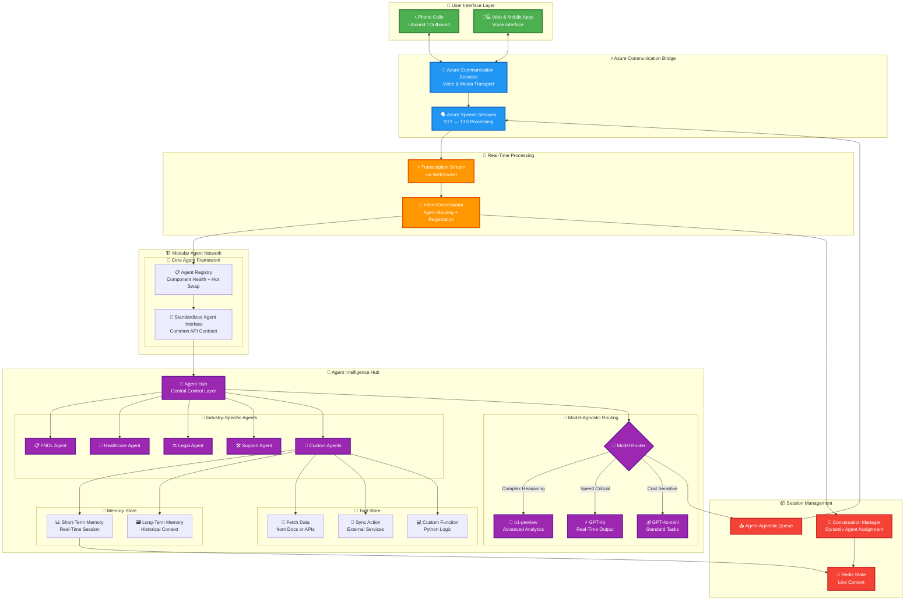

<!-- markdownlint-disable MD033 -->

# **🎙️ RTMedAgent: Real-Time Voice Intelligence for Healthcare Workflows**

## 📑 Table of Contents
- [Overview](#overview)
- [Solution Architecture](#solution-architecture)
- [Getting Started](#getting-started)
  - [Quick Start](#quick-start)
- [Deployment](#deployment)

---

## **Overview**


**RTMedAgent** is a reference implementation of a **real-time, voice-first virtual agent** powered by **Azure AI**. It enables healthcare organizations to deliver safe, empathetic, and intelligent phone experiences for common patient needs—reducing human hand-offs for routine tasks.

> “Healthcare call centers spend, on average, 43% of their annual operating budget on labor but only 0.6% on technology to prevent agent burnout.” – *Hyro, 2023 Report*

### **Why Healthcare Call Centers Need AI**

| **Challenge**              | **Impact**                          |
|-----------------------------|--------------------------------------|
| 🔄 High agent turnover (30–45%) | Rising hiring/training costs       |
| 😫 Staff burnout            | Lower service quality & satisfaction |
| 💰 High labor share of budget | Less room for innovation            |
| 📉 Inconsistent service     | Patient frustration & delays         |

## **Solution Architecture**

The high-level RTMedAgent architecture:


1. **Browser** streams audio via **WebSocket** ↔️ backend.  
2. **Speech-to-Text** (Azure Speech) transcribes audio.  
3. **Azure OpenAI** analyzes intent and orchestrates tools.  
4. **Azure AI Search** enriches context for accurate answers.  
5. **Text-to-Speech** generates natural responses.  
6. **Observability** is handled through **Azure AI Studio** and **Application Insights**.

Detailed framework approach:



Please visit 📄 **[Architecture Guide](docs/Architecture.md)** for more details.

## **Deployment**

A full IaC walkthrough—including networking, SSL, scalability, and CI/CD—is in 📄 **[Deployment Guide](docs/DeploymentGuide.md)**

## **Getting Started**

**Understanding Folder Structure**

The RTMedAgent project is organized into the following folders:

```
rtagents/
└─ RTMedAgent/
  ├─ backend/      # FastAPI WebSocket server for real-time transcription and GPT orchestration
  ├─ frontend/     # React + Vite client leveraging Azure Speech SDK for voice interactions
  ├─ test_cases_scenario/  # Optional test scripts and scenarios for validating workflows
  └─ README.md     # Project documentation and setup instructions
```

Each folder serves a specific purpose to ensure modularity and ease of development. For example:
- **backend/** handles server-side logic, including WebSocket communication and AI orchestration.
- **frontend/** provides the user interface for interacting with the voice agent.
- **test_cases_scenario/** contains optional resources for testing and debugging specific use cases.
- **README.md** (You are here)

Refer to the folder descriptions above as you navigate the codebase.

### **Quick Start**

Follow these steps to set up and run RTMedAgent locally:

**Step 1: Clone the Repository**
```bash
git clone https://github.com/your-org/gbb-ai-audio-agent.git
cd gbb-ai-audio-agent
```

**Step 2: Set Up the Python Backend**
```bash
cd rtagents/RTMedAgent/backend
python -m venv .venv && source .venv/bin/activate
pip install -r requirements.txt
cp .env.sample .env   # Fill in the required keys
python server.py      # Backend will run at ws://localhost:8010/realtime
```

**Step 3: Run the React Frontend**
```bash
cd ../frontend
npm install
npm run dev           # Frontend will run at http://localhost:5173
```

> **Pro Tip:** For outbound PSTN calling, expose the backend using **Azure Dev Tunnels**. Update the `BASE_URL` in your environment variables and ensure the same URL is configured in your **Azure Communication Services** callback settings.


