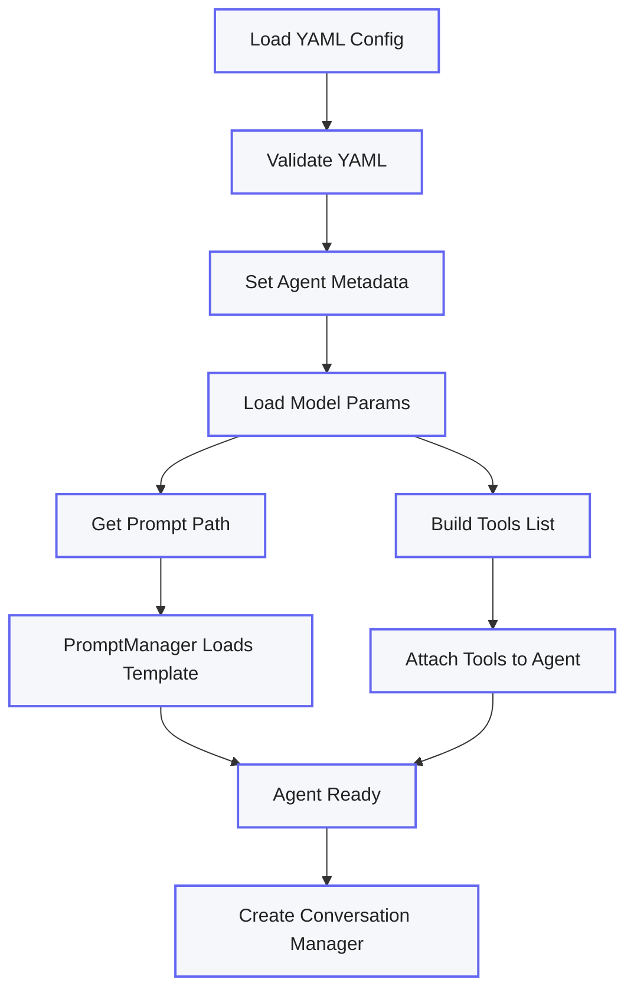
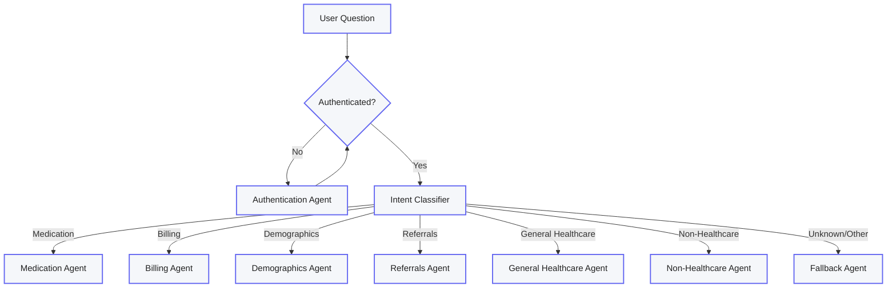
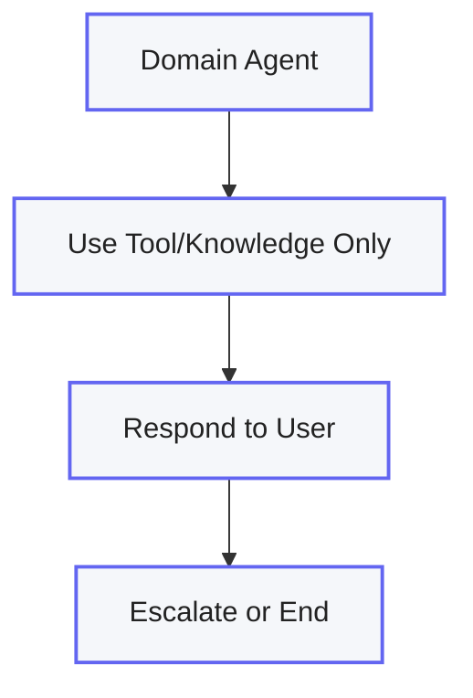
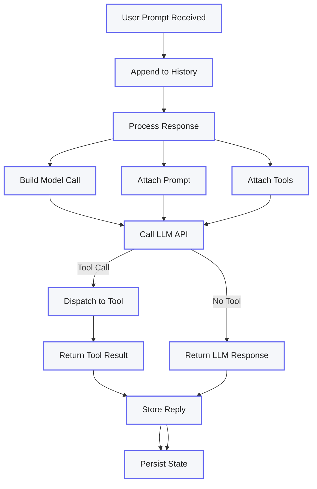

# RTInsuranceAgent – Agent Architecture & Orchestration

## 🧭 Agent Initialization Flow

<br>

**Agent Configuration Loading**

<br>



<br>

## 🚀 How to Create a Single Agent

To add a new domain agent in RTInsuranceAgent, follow these steps:

### 1. Define Agent Configuration
Create a YAML config file (e.g., `agent.yaml`) specifying:
- **Agent metadata** (name, org, description)
- **Model parameters** (deployment, temperature, etc.)
- **Prompt template path**
- **List of tools** this agent can access

### 2. Initialize the Agent
- Backend code loads and validates the YAML
- Sets up agent properties, model params, and links prompt/tool managers

### 3. Attach Tools and Prompts
- Ensure each agent is connected to only the tools and prompts defined in its config

### 4. Start a User Session
- When a session begins, instantiate the agent and create a `MemoManager` for tracking history and context

### 5. Handle User Prompts
- On receiving a prompt, append it to history, process with the agent (which attaches the correct model, prompt, and tools), then persist the state for continuity

#### Example `agent.yaml`
```yaml
name: MedicationAgent
organization: RTMed
description: Handles medication-related queries
model:
  deployment_id: gpt-4
  temperature: 0.2
prompts:
  path: prompts/medication_prompt.txt
tools:
  - medication_lookup
  - drug_interaction_checker
```

## 🕹️ Agent Orchestration & Routing Flow

**Agent Routing**

<br>


<br>

**Tool/Knowledge Enforcement and Response**

<br>



**Agent Responds to User Prompt**

<br>




---

## ⚙️ How the Flow Works

1. **User Message**  
   A user sends a question/utterance to the system.
2. **Authentication Check**  
   If not authenticated, the Authentication Agent prompts for identity and credentials.
3. **Intent Classification**  
   Once authenticated, the Intent Classifier agent determines the category (e.g., Medication, Billing, etc.).
4. **Domain Agent Routing**  
   The classified request is routed to the correct domain agent for that task.
5. **Tool/Knowledge Enforcement**  
   Each domain agent can only respond using approved tools or enterprise knowledge—never open-ended LLM knowledge.
6. **Response or Escalation**  
   The agent replies to the user or, if unable, escalates to a fallback (e.g., a human agent or “Sorry, I can’t answer that” message).

---

## 🏆 Key Best Practices

- **Strict intent mapping:** Always classify before routing to a domain agent
- **No hallucination:** Domain agents must use only tool-based or knowledge-backed answers (not general LLM knowledge)
- **Modularity:** Agents and tools are configured via YAML for easy updates and auditability
- **Persistence:** Conversation state and context are tracked for every session, allowing safe multi-turn dialog

---

> This is the foundation for a safe, auditable, and enterprise-grade agent orchestration platform in healthcare or any other regulated industry.

---

*Let us know if you want a third diagram for error handling, audit logging, or a sequence diagram for step-by-step processing!*