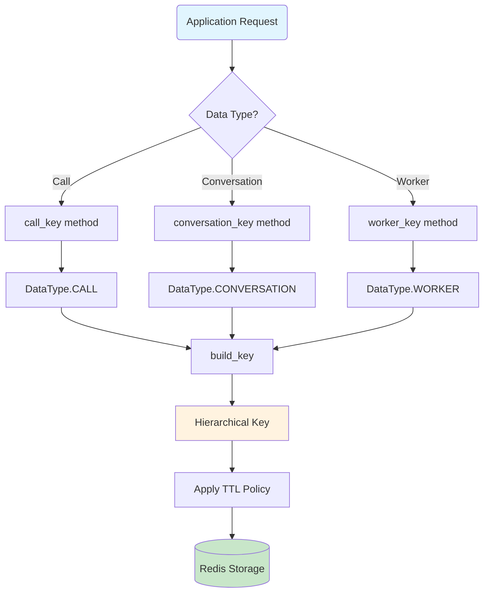
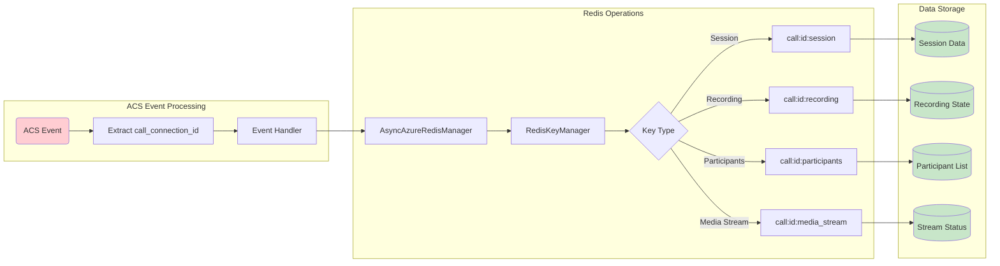
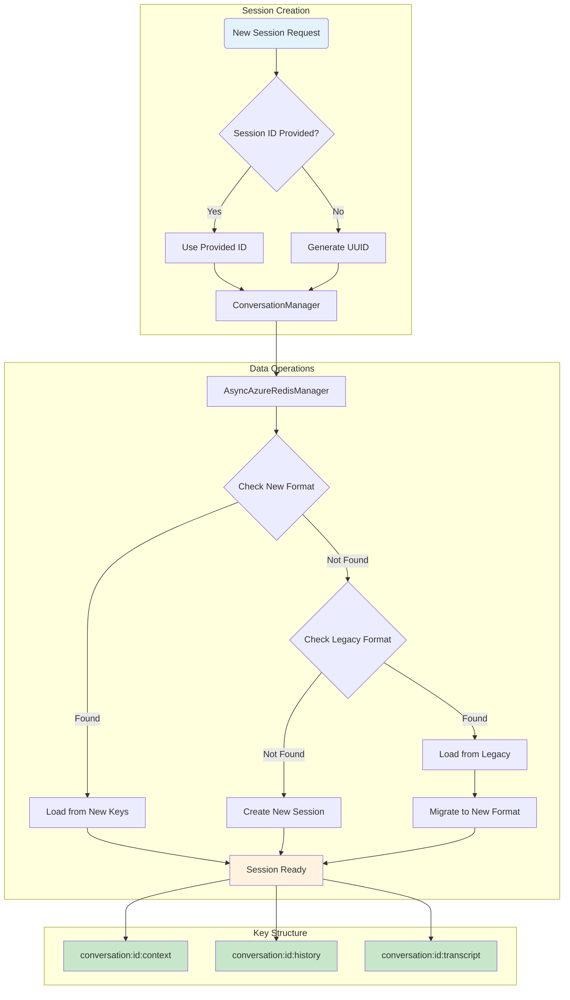
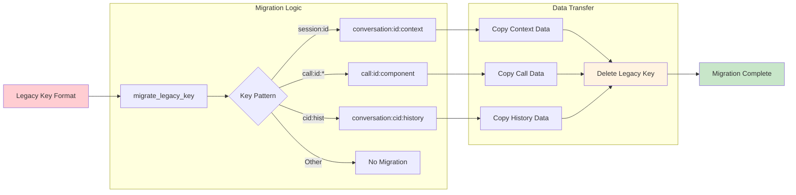
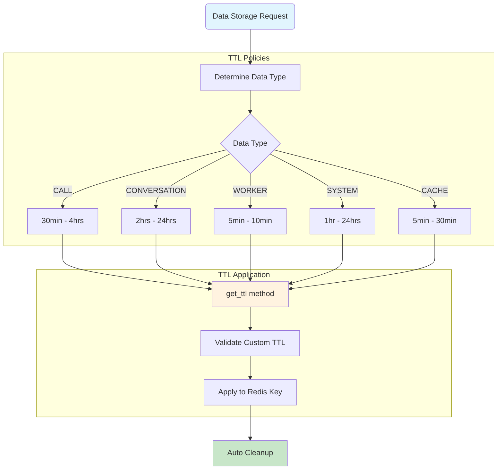
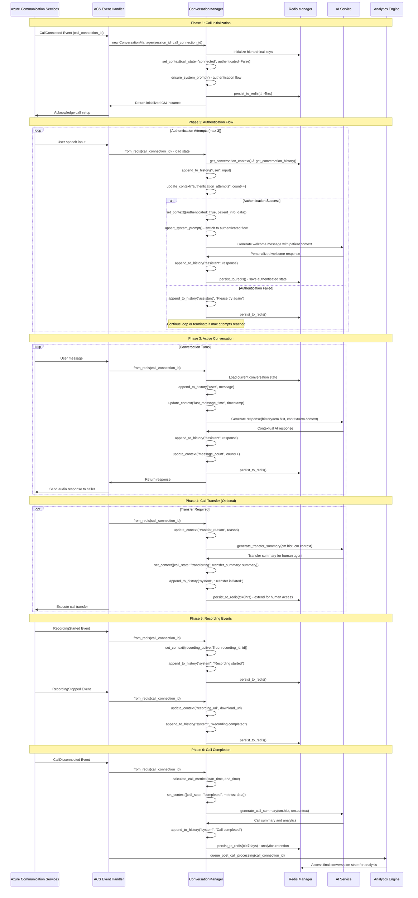

# Redis Implementation Documentation

> DEPRECATED: This documentation is for the legacy Redis implementation. Please refer to the new RTAgent Voice AI Backend documentation for the latest architecture and usage patterns.

## Overview

The RTAgent Voice AI Backend uses a sophisticated Redis-based session management system that provides hierarchical key organization, automatic TTL management, and seamless data persistence for Azure Communication Services (ACS) calls and conversation sessions.

## Architecture Components

### 1. RedisKeyManager
The central component responsible for hierarchical key structure and TTL management.

### 2. AsyncAzureRedisManager
Provides high-level async operations for conversation and call management.

### 3. ConversationManager
Handles conversation state with automatic migration between legacy and new key formats.

## Key Structure

The system uses a hierarchical key format:
```
{app_prefix}:{environment}:{data_type}:{identifier}:{component}
```

### Examples:
- `rtvoice:prod:call:call-connection-id-1234:session` (ACS call using call_connection_id)
- `rtvoice:prod:conversation:session-id-5678:context` (conversation using session_id)
- `rtvoice:dev:worker:worker-abc123:affinity` (worker using worker_id)

## Component Flow Diagrams

### 1. Redis Key Manager Flow



### 2. ACS Call Session Management



### 3. Conversation State Management



### 4. Legacy Migration Process



### 5. TTL Management System



## Usage Patterns

### 1. ACS Call Session Setup

```python
# For ACS calls, always use the call_connection_id as the identifier
async def handle_call_connected(call_connection_id: str):
    # Store call session data
    session_key = redis_manager.key_manager.call_key(
        call_connection_id, 
        Component.SESSION
    )
    await redis_manager.store_call_session(call_connection_id, session_data)
    
    # Store participant information
    participants_key = redis_manager.key_manager.call_key(
        call_connection_id, 
        Component.PARTICIPANTS
    )
    await redis_manager.set_value(participants_key, participants_data)
```

### 2. Conversation Management

```python
# Create conversation manager with automatic key management
async def setup_conversation(session_id: str = None):
    cm = ConversationManager(
        session_id=session_id,  # Uses call_connection_id for ACS calls
        environment="prod"
    )
    
    # Load existing session or create new one
    cm = await ConversationManager.from_redis(session_id, redis_mgr)
    
    # Update conversation context
    await cm.update_context({"user_authenticated": True})
    
    # Add to conversation history
    await cm.append_to_history("user", "Hello")
```

### 3. Recording State Management

```python
# Store recording state for ACS calls
async def start_recording(call_connection_id: str, recording_id: str):
    recording_data = {
        "recording_id": recording_id,
        "state": "started",
        "storage_account": "recordings_storage"
    }
    
    await redis_manager.store_recording_state(
        call_connection_id, 
        recording_data
    )
```

### 4. Worker Affinity Management

```python
# Set worker affinity for call processing
async def assign_worker(call_connection_id: str, worker_id: str):
    await redis_manager.set_worker_affinity(
        call_connection_id, 
        worker_id
    )
    
    # Get assigned worker
    assigned_worker = await redis_manager.get_worker_affinity(
        call_connection_id
    )
```

## Data Flow Integration

### ACS Call Lifecycle with ConversationManager Integration



## Best Practices

### 1. Key Naming
- **Always use actual identifiers**: For ACS calls, use the `call_connection_id` provided by Azure Communication Services
- **Avoid generating UUIDs**: When external identifiers exist (like call_connection_id), use them directly
- **Consistent environment naming**: Use standard environment names: `dev`, `test`, `staging`, `prod`

### 2. TTL Management
- **Let the system manage TTLs**: Use the built-in TTL policies unless you have specific requirements
- **Custom TTLs for special cases**: Only override TTLs when you need longer persistence for specific use cases
- **Monitor expiration**: Implement monitoring for critical data that shouldn't expire unexpectedly

### 3. Migration Handling
- **Gradual migration**: The system supports both legacy and new key formats simultaneously
- **Automatic migration**: Use the built-in migration methods rather than manual key conversion
- **Verify migration**: Always verify that data is accessible after migration

### 4. Error Handling
- **Graceful degradation**: Handle Redis connection failures gracefully
- **Retry logic**: Implement exponential backoff for transient failures
- **Fallback strategies**: Have fallback mechanisms when Redis is unavailable

### 5. Performance Optimization
- **Batch operations**: Use batch operations for multiple related keys
- **Connection pooling**: Leverage the built-in connection pooling
- **Async operations**: Always use async methods for non-blocking operations

## Environment Configuration

### Development
```yaml
ENVIRONMENT: dev
REDIS_HOST: localhost
REDIS_PORT: 6379
TTL_MULTIPLIER: 0.5  # Shorter TTLs for testing
```

### Production
```yaml
ENVIRONMENT: prod
REDIS_HOST: redis-cluster.region.cache.windows.net
REDIS_PORT: 6380
REDIS_SSL: true
TTL_MULTIPLIER: 2.0  # Longer TTLs for production
```

## Monitoring and Debugging

### Key Metrics to Monitor
- **Key creation rate**: Monitor new session creation
- **TTL distribution**: Ensure keys are expiring as expected
- **Migration success rate**: Track legacy key migrations
- **Memory usage**: Monitor Redis memory consumption
- **Operation latency**: Track Redis operation performance

### Debugging Tools
```python
# List all keys for a specific call
pattern = redis_manager.key_manager.get_pattern(DataType.CALL, call_connection_id)
keys = await redis_manager.scan_keys(pattern)

# Check TTL for a specific key
key = redis_manager.key_manager.call_key(call_connection_id, Component.SESSION)
ttl = await redis_manager.get_ttl(key)

# Migrate legacy keys manually if needed
legacy_key = "session:old-format-id"
new_key = redis_manager.key_manager.migrate_legacy_key(legacy_key)
```

## Security Considerations

### 1. Data Privacy
- **Sensitive data encryption**: Encrypt sensitive conversation data before storage
- **Access control**: Implement proper access controls for Redis instances
- **Network security**: Use TLS/SSL for Redis connections in production

### 2. Key Security
- **Predictable patterns**: Avoid exposing internal system details in key names
- **Access logging**: Log access to sensitive conversation data
- **Key rotation**: Implement key rotation for long-lived sessions

### 3. Compliance
- **Data retention**: Respect data retention policies with appropriate TTLs
- **Audit trails**: Maintain audit trails for data access and modifications
- **Cleanup procedures**: Implement proper cleanup for terminated sessions

This Redis implementation provides a robust, scalable foundation for the RTAgent Voice AI Backend, ensuring efficient session management while maintaining data integrity and performance.

## End-to-End ConversationManager Usage

The ConversationManager is the primary interface for handling conversation state throughout the entire ACS call lifecycle. This section demonstrates proper integration patterns from call initiation to completion, with comprehensive examples showing how to leverage the ConversationManager as the central state management component for Azure Communication Services calls.

### Overview of ConversationManager Integration

The ConversationManager serves as the stateful backbone of every ACS call, providing:

- **Session State Management**: Persistent storage of conversation context and history
- **Authentication Flow**: Seamless handling of user authentication with state persistence
- **Context-Aware Responses**: AI-powered responses using full conversation context
- **Event Integration**: Integration with ACS events (recording, transfers, disconnections)
- **Analytics Support**: Call metrics and summary generation for post-call analysis
- **Legacy Migration**: Automatic migration from legacy key formats

### Complete Call Lifecycle with ConversationManager

### ConversationManager Architecture Patterns

#### Key Design Principles

1. **Session ID as Call Connection ID**: Always use the ACS `call_connection_id` as the `session_id` for ConversationManager instances. This ensures:
   - Direct correlation between ACS events and conversation state
   - Simplified debugging and tracing across ACS and Redis logs
   - Automatic cleanup when calls terminate

2. **Hierarchical State Management**: ConversationManager leverages Redis hierarchical keys:
   ```
   rtvoice:prod:conversation:call-connection-id-1234:context
   rtvoice:prod:conversation:call-connection-id-1234:history
   ```

3. **Event-Driven State Updates**: Every ACS event should trigger a ConversationManager state update:
   - Call events → context updates
   - User messages → history appends
   - System events → system message logs

4. **Context-Aware AI Integration**: Use full conversation context for AI responses:
   - Patient authentication status
   - Call duration and message count
   - Recording state and previous interactions
   - Transfer history and escalation context

#### Integration Patterns

The ConversationManager follows specific patterns for different call phases:

| Phase | Pattern | Key Operations |
|-------|---------|----------------|
| **Initialization** | Factory + Setup | `new ConversationManager()` → `ensure_system_prompt()` → `persist_to_redis()` |
| **Authentication** | Load + Validate + Update | `from_redis()` → validate credentials → `update_context()` → `upsert_system_prompt()` |
| **Conversation** | Load + Process + Store | `from_redis()` → `append_to_history()` → AI processing → `persist_to_redis()` |
| **Events** | Load + Log + Persist | `from_redis()` → `append_to_history("system")` → `update_context()` → `persist_to_redis()` |
| **Completion** | Load + Summarize + Archive | `from_redis()` → generate summary → final `persist_to_redis(extended_ttl)` |


### Best Practices for ConversationManager Usage

#### 1. Session ID Management
- **Always use `call_connection_id`** as the session_id for ACS calls
- **Never generate random UUIDs** when a meaningful identifier exists
- **Maintain session continuity** across call events and state changes

#### 2. Context Management
- **Set comprehensive initial context** during call connection
- **Update context incrementally** rather than replacing entire context
- **Use consistent key naming** for context attributes
- **Store temporal data** (timestamps, durations, counts) for analytics

#### 3. History Management
- **Add system messages** for important call events (recording, transfers)
- **Maintain conversation chronology** with proper role assignments
- **Limit history size** for very long conversations to manage memory
- **Include metadata** in system messages for debugging

#### 4. Error Handling and Recovery
- **Gracefully handle Redis failures** with fallback mechanisms
- **Implement retry logic** for transient failures
- **Validate conversation state** after loading from Redis
- **Log state transitions** for debugging and monitoring

#### 5. Performance Optimization
- **Use appropriate TTL values** based on call lifecycle phase
- **Batch Redis operations** when updating multiple context keys
- **Implement conversation state caching** for frequently accessed sessions
- **Monitor memory usage** for large conversation histories

This comprehensive approach ensures that the ConversationManager serves as a robust, stateful backbone for the entire call experience, maintaining context and conversation flow while integrating seamlessly with ACS events and Redis storage.
